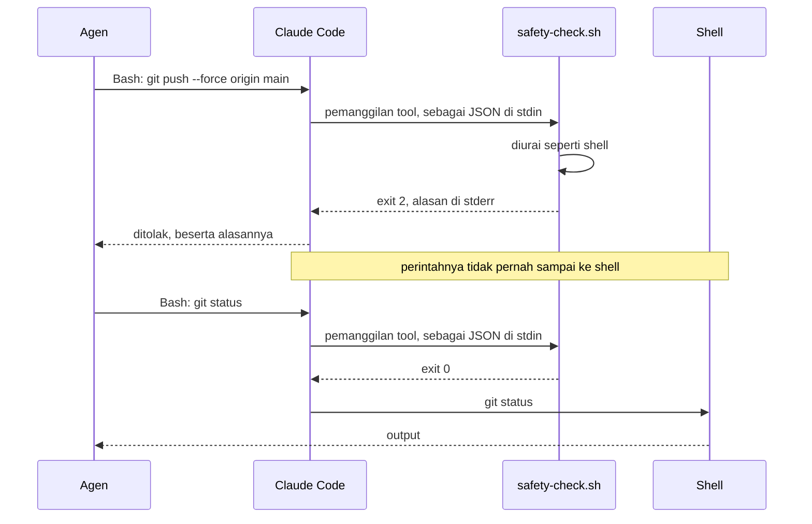
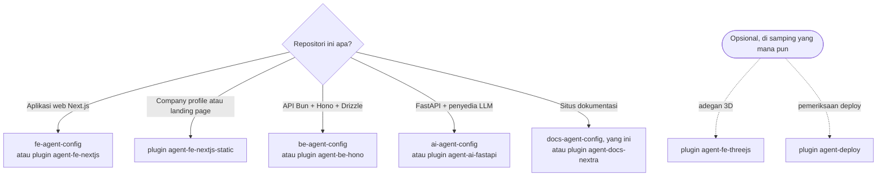
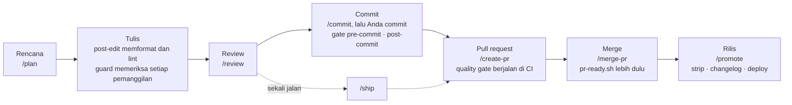
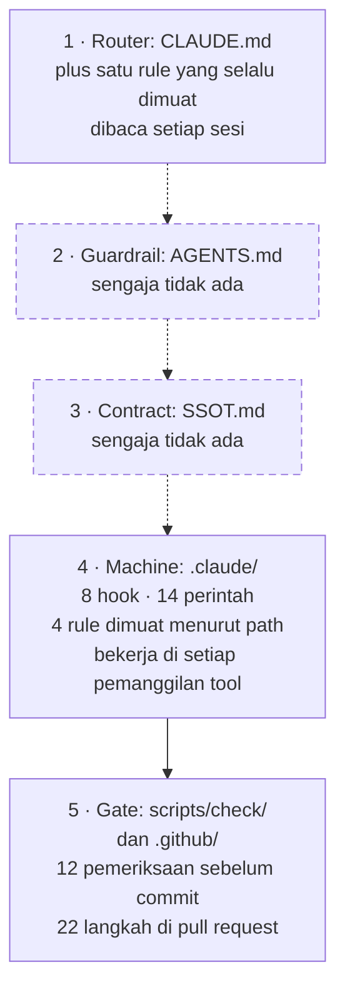

[English](README.md) | **Bahasa Indonesia**

<h1 align="center">
  <picture>
    <source media="(prefers-color-scheme: dark)" srcset="docs/assets/banner-docs-dark.svg">
    <source media="(prefers-color-scheme: light)" srcset="docs/assets/banner-docs-light.svg">
    
  </picture>
</h1>

<p align="center">
  <a href="LICENSE"></a>
  <a href="#ci-hanya-pull-request"></a>
  <a href="#lebih-suka-plugin"></a>
</p>

**Lapisan Claude Code untuk situs dokumentasi yang diekspor statis: rule, hook, perintah, dan gate
yang benar-benar keluar dengan kode gagal, bukan sekadar meminta dengan sopan.** Dibuat untuk Nextra
di atas Next.js, dan di-deploy sebagai Cloudflare Worker yang hanya menyajikan aset.

> [!TIP]
> **Ringkasnya.** Salin lapisan ini ke repositori dokumentasi Anda, isi placeholder-nya, lalu
> buktikan dengan satu perintah. Sejak itu Claude Code tidak bisa mengedit halaman hasil generate
> dengan tangan, push ke `dev`, `prod` atau `main`, membaca file `.env` ke dalam chat, atau
> melewati gate pre-commit: setiap percobaan ditolak dengan exit code 2 dan alasan yang menjelaskan
> apa yang harus dilakukan sebagai gantinya. Perubahan `.env` dan penulisan ke database produksi
> tetap terkunci sampai *Anda sendiri* membukanya selama beberapa menit. Semuanya berjalan di mesin
> Anda, dan CI hanya berjalan pada pull request. Lebih suka memasang daripada menyalin? Pakai
> [plugin `agent-docs-nextra`](#lebih-suka-plugin).

**Lebih suka plugin?** Lapisan yang sama terpasang dalam tiga langkah, tanpa menyalin file. Di dalam
Claude Code:

```text
/plugin marketplace add adhibuchori/agent-config-kit
/plugin install agent-docs-nextra@agent-config-kit
/agent-docs-nextra:setup
```

Memasang `agent-docs-nextra` juga memasang `agent-core`, yang menjadi dependensinya. Setup
menampilkan dry run dan baru menulis setelah Anda membalas **go**.
[Lebih suka plugin?](#lebih-suka-plugin) membandingkan kedua cara.

## Daftar isi

1. [Mengapa ini ada](#mengapa-ini-ada): delapan kegagalan, plus sebelum dan sesudah
2. [Lihat cara kerjanya](#lihat-cara-kerjanya)
3. [Untuk siapa, dan bukan untuk siapa](#untuk-siapa-dan-bukan-untuk-siapa)
4. [Pilih template atau plugin](#pilih-template-atau-plugin) dan
   [Lebih suka plugin?](#lebih-suka-plugin)
5. [Kebutuhan](#kebutuhan) dan [Mulai cepat](#mulai-cepat)
6. [Sehari-hari dengan lapisan ini](#sehari-hari-dengan-lapisan-ini)
7. [Apa saja yang terpasang](#apa-saja-yang-terpasang) dan
   [cara semuanya tersambung](#cara-semuanya-tersambung)
8. [Semua isi template ini](#semua-isi-template-ini): [hook](#hook), [perintah](#perintah),
   [agen](#agen), [skill](#skill), [aturan](#aturan), [anti-pattern](#anti-pattern),
   [pemeriksaan dan gate](#pemeriksaan-dan-gate), [workflow CI](#workflow-ci),
   [file konfigurasi](#file-konfigurasi)
9. [Konfigurasi](#konfigurasi) dan [memakai RTK](#memakai-rtk)
10. [Membuka kunci `.env` dan DB produksi](#membuka-kunci-env-dan-db-produksi)
11. [CI: hanya pull request](#ci-hanya-pull-request)
12. [Model keamanan](#model-keamanan),
    [apa yang ditolak hook](#apa-yang-ditolak-hook-dan-cara-mematikannya), serta
    [biaya dan beban](#biaya-dan-beban)
13. [Memperbarui dan mencopot](#memperbarui-dan-mencopot)
14. [Resep kustomisasi](#resep-kustomisasi) dan
    [keputusan desain yang perlu diketahui](#keputusan-desain-yang-perlu-diketahui-sebelum-mengedit)
15. [Contoh jadi](#contoh-jadi-repo-template)
16. [FAQ dan pemecahan masalah](#faq-dan-pemecahan-masalah)
17. [Glosarium, roadmap, dan cakupan](#glosarium-roadmap-dan-cakupan)

---

## Mengapa ini ada

Instruksi di `CLAUDE.md` hanyalah permintaan. Hook yang keluar dengan exit 2 adalah tembok. Setiap
cerita di bawah adalah kegagalan yang benar-benar terjadi di situs dokumentasi, apa yang dilakukan
lapisan ini untuk mencegahnya, dan bagian mana yang bekerja.

1. **Editan tangan di halaman hasil generate hilang.**
   *Masalahnya:* ada salah ketik di halaman referensi SDK. Agen memperbaikinya di
   `content/technical/sdk.mdx`, review lolos, lalu `bun run docs:generate` berikutnya menulis ulang
   halaman itu dari komentar kode sumber. Perbaikannya lenyap, dan tidak ada yang sadar selama
   berminggu-minggu.
   *Solusinya:* Anda mendaftarkan halaman yang ditulis generator, dan setiap editan tangan ke
   halaman itu ditolak, lengkap dengan petunjuk ke sumbernya.
   *Ditangani oleh:* [`generated-guard.sh`](#hook), rule [`docs-site/content.md`](#aturan),
   [SETUP §4](SETUP.md#point-the-generated-content-guard-at-your-output).

2. **Agen melakukan force-push ke branch yang di-deploy.**
   *Masalahnya:* rebase berantakan, lalu agen "memperbaikinya" dengan
   `git push --force origin prod`. Halaman yang di-merge kemarin hilang dari situs live.
   *Solusinya:* push ke, atau penghapusan, `dev`, `prod`, `main` atau `master` ditolak: lewat
   refspec, lewat `--all` atau `--mirror`, lewat branch yang sedang di-checkout, dari shell maupun
   dari tool MCP GitHub. Pekerjaan sampai ke `prod` melalui pull request.
   *Ditangani oleh:* [`safety-check.sh`](#hook), [`mcp-guard.sh`](#hook), daftar `deny` di
   [`.claude/settings.json`](#file-konfigurasi), [`/create-pr`](#perintah), [`/promote`](#perintah).

3. **Secret bocor ke transkrip.**
   *Masalahnya:* generator changelog gagal, dan "coba saya cek konfigurasinya" berubah menjadi
   `cat .env.development`. Token GitHub Anda kini ada di log chat.
   *Solusinya:* tidak ada perintah shell yang boleh membaca atau menulis file `.env*` asli, lewat
   jalur apa pun yang bisa dibaca hook. Claude melihat daftar key lewat helper yang menyamarkan
   setiap secret, dan hanya bisa mengubah nilai setelah Anda sendiri membuka kunci `env`. Sandbox
   Bash menolak pembacaan yang sama di tingkat sistem operasi.
   *Ditangani oleh:* [`safety-check.sh`](#hook), [`scripts/env/`](#pemeriksaan-dan-gate),
   [mekanisme unlock](#membuka-kunci-env-dan-db-produksi), sandbox di
   [`.claude/settings.json`](#file-konfigurasi).

4. **Rule di `CLAUDE.md` diabaikan.**
   *Masalahnya:* `CLAUDE.md` bilang "jangan pernah melewati hook pre-commit". Dua jam kemudian,
   error lint menghalangi commit, dan agen menjalankan `git commit --no-verify`.
   *Solusinya:* rule yang penting dijadikan hook dan baris gate, bukan sekadar tulisan.
   `--no-verify`, `HUSKY=0` dan kerabatnya ditolak, dan daftar gate berjalan di setiap commit. Rule
   lain hanya dimuat saat file yang cocok sedang dibuka, dan batas ukuran byte menjaga bagian yang
   selalu dimuat tetap cukup pendek untuk benar-benar dibaca.
   *Ditangani oleh:* [`safety-check.sh`](#hook),
   [`gates.list` dan `.husky/pre-commit`](#pemeriksaan-dan-gate), [rule-rule](#aturan),
   [`ai-config.sh`](#pemeriksaan-dan-gate).

5. **Salinan melenceng.**
   *Masalahnya:* slash command yang sama ada untuk dua tool, dan YAML CI yang sama ada di banyak
   repo. Satu perbaikan masuk ke satu salinan saja; salinan lain tetap membawa bug, dan tidak ada
   yang memberi tahu.
   *Solusinya:* setiap perintah ditulis sekali di `_workflow-source/` lalu dicerminkan, dan gate
   gagal saat sebuah cermin melenceng. Setiap action di-pin ke sebuah commit, dan pull request yang
   mengubah workflow akan di-lint. Untuk banyak repo, reusable workflow milik plugin menyimpan satu
   salinan untuk semuanya.
   *Ditangani oleh:* [`scripts/sync/workflows.sh`](#pemeriksaan-dan-gate),
   [`workflows-lint.yml`](#workflow-ci), [Lebih suka plugin?](#lebih-suka-plugin).

6. **Pull request yang di-merge diam-diam tidak menjalankan apa pun.**
   *Masalahnya:* pesan commit membawa penanda skip-CI. Promosi ke `prod` tidak menjalankan
   pemeriksaan maupun deploy, dan GitHub hanya menampilkan "no checks", yang terlihat seperti
   antrean lambat.
   *Solusinya:* tidak ada workflow, skrip, atau perintah yang menulis penanda skip-CI, merge selalu
   berupa merge commit, dan pemeriksaan merge menganggap pemeriksaan yang di-skip sebagai belum
   lolos.
   *Ditangani oleh:* [`pr-ready.sh`](#pemeriksaan-dan-gate), [`/merge-pr`](#perintah),
   [RATIONALE §7](docs/RATIONALE.md#7-the-skip-ci-marker-that-disarms-gates-silently).

7. **Komentar kode sumber yang benar malah merusak build MDX.**
   *Masalahnya:* sebuah komentar menulis `Array<string>` atau `{id}`. Generator menyalinnya ke
   halaman, dan MDX membacanya sebagai tag atau ekspresi. Build gagal karena teks yang sebenarnya
   tidak salah.
   *Solusinya:* lakukan escaping saat render, bukan saat menulis. Rule konten dan SETUP §6
   menyebut dua jebakannya, dan indeks anti-pattern mencatat perusak build yang sudah dikenal.
   *Ditangani oleh:* [`docs-site/content.md`](#aturan),
   [SETUP §6](SETUP.md#the-two-escaping-traps),
   [RATIONALE §10](docs/RATIONALE.md#10-text-that-is-hostile-to-the-mdx-build).

8. **Agen menghapus pekerjaan orang lain.**
   *Masalahnya:* dua sesi berbagi satu checkout. Salah satunya menjalankan `git reset --hard` atau
   `git stash` tanpa pathspec supaya "mulai bersih", atau `rm -rf content`.
   *Solusinya:* perintah yang menghapus pekerjaan yang belum di-commit atau menghapus path yang
   dilindungi ditolak, commit dilakukan per pathspec, dan setelah setiap commit Claude diperlihatkan
   file apa saja yang benar-benar ikut.
   *Ditangani oleh:* [`safety-check.sh`](#hook), [`post-commit.sh`](#hook),
   [`/checkpoint`](#perintah).

<details>
<summary><strong>Sebelum dan sesudah: lima menit yang sama, tanpa dan dengan lapisan ini</strong></summary>

### Tanpa lapisan ini

```text
Anda:    Ada salah ketik di bagian auth halaman SDK, dan job changelog gagal. Perbaiki keduanya.
Claude:  Edit content/technical/sdk.mdx                  ← docs:generate berikutnya menghapusnya
Claude:  Saya cek tokennya.         $ cat .env.development
         GITHUB_TOKEN=ghp_…                              ← token sekarang ada di chat
Claude:  Lint gagal di file lama, saya commit saja.      $ git commit --no-verify -m "fix typo"
Claude:  $ git push --force origin prod                  ← langsung ke branch yang di-deploy
```

### Dengan lapisan ini

```text
Anda:    Ada salah ketik di bagian auth halaman SDK, dan job changelog gagal. Perbaiki keduanya.
Claude:  Edit content/technical/sdk.mdx
         [generated-guard] BLOCKED: content/technical/sdk.mdx is generated output
         (content/technical in generatedPaths).
         Change its source and run the project's generator instead of editing it.
Claude:  Salah ketiknya ada di komentar kode sumber di repo aplikasi. Ini perbaikan satu barisnya
         di sana; setelah itu saya jalankan ulang `bun run docs:generate`.
Claude:  $ cat .env.development
         [safety] BLOCKED: .env.development holds secrets, and the shell never reads or writes
         a real .env* file directly: … List its keys with
         `bash scripts/env/show.sh .env.development` (secret values masked). …
Claude:  $ bash scripts/env/show.sh .env.development
         .env.development: 6 keys
           GITHUB_TOKEN     ghp_…(42 chars)
           …
         Tokennya sudah terisi, jadi job gagal karena hal lain. Untuk mengganti token, Anda perlu
         menjalankan `! bun unlock env` sendiri terlebih dulu.
Claude:  $ git commit --no-verify -m "fix typo"
         [safety] BLOCKED: skipping the pre-commit gate is not allowed. Fix what it reports.
Claude:  $ git push --force origin prod
         [safety] BLOCKED: pushing to a protected branch (dev/prod/main/master) is not allowed. …
Claude:  $ git push -u origin internal/sdk-typo      (diizinkan; lalu /create-pr)
```

Penolakan di atas adalah pesan asli dari hook, direkam di salinan baru template ini (dipersingkat
dengan `…`). Baris di sekitarnya menunjukkan di mana pesan itu muncul dalam sebuah sesi.

</details>

---

## Lihat cara kerjanya

<picture>
  <source media="(prefers-color-scheme: dark)" srcset="docs/assets/demo-blocked-dark.svg">
  <source media="(prefers-color-scheme: light)" srcset="docs/assets/demo-blocked-light.svg">
  
</picture>

Inilah yang benar-benar dikirim balik oleh hook. Claude Code memberikan pemanggilan tool ke hook
dalam bentuk JSON; hook menjawab dengan exit code 2 dan alasan di stderr, yang dibaca dan
ditindaklanjuti Claude:

```text
tool call  Bash  {"command": "git push --force origin main"}
exit 2     [safety] BLOCKED: pushing to a protected branch (dev/prod/main/master) is not allowed.
           Push your work branch and open a PR; when a release needs this push, the user runs it
           with `!`.

tool call  Bash  {"command": "git status"}
exit 0     (tidak ada output: perintahnya berjalan)
```

Coba sendiri dari root repositori yang sudah memasang lapisan ini:

```bash
echo '{"tool_name":"Bash","tool_input":{"command":"git push --force origin main"}}' |
  bash .claude/hooks/safety-check.sh; echo "exit $?"    # alasan di stderr, lalu: exit 2
echo '{"tool_name":"Bash","tool_input":{"command":"git status"}}' |
  bash .claude/hooks/safety-check.sh; echo "exit $?"    # exit 0
```

<picture>
  <source media="(prefers-color-scheme: dark)" srcset="docs/assets/hook-flow-dark.svg">
  <source media="(prefers-color-scheme: light)" srcset="docs/assets/hook-flow-light.svg">
  
</picture>



Banner, demo, alur hook, dan alur unlock dianimasikan hanya dengan CSS: si landak berkedip,
perintahnya seolah diketik, dan gemboknya membuka lalu menutup. Jika sistem Anda meminta gerakan
dikurangi (reduced motion), setiap gambar tampil diam.

---

## Untuk siapa, dan bukan untuk siapa

<picture>
  <source media="(prefers-color-scheme: dark)" srcset="docs/assets/mascot-dark.svg">
  <source media="(prefers-color-scheme: light)" srcset="docs/assets/mascot-light.svg">
  
</picture>

**Cocok jika Anda:**

- mengelola situs dokumentasi yang diekspor statis, idealnya Nextra di atas Next.js, dan membiarkan
  Claude Code (CLI atau ekstensi IDE) bekerja di dalamnya;
- menghasilkan sebagian halaman dari repositori lain (referensi API, changelog) dan menulis sisanya
  dengan tangan;
- menginginkan penolakan yang bisa Anda baca, uji, dan matikan, bukan sekadar saran di prompt.

**Kurang cocok jika Anda:**

- butuh starter situs: di sini tidak ada `content/`, `app/`, `package.json` atau lockfile, hanya
  lapisan agen di sekitar situs Anda;
- membangun aplikasi yang kebetulan punya halaman dokumentasi: aplikasi punya logika domain, jadi
  [`fe-agent-config`](https://github.com/adhibuchori/fe-agent-config) lebih pas;
- menginginkan batas keamanan terhadap agen yang berniat jahat: hook membaca teks perintah dan
  berfungsi sebagai pagar pengaman terhadap kekeliruan dan instruksi yang disisipkan (lihat
  [Model keamanan](#model-keamanan));
- bekerja dengan tool AI selain Claude Code: rule, gate, dan skripnya tetap bisa dipakai, tetapi
  wiring hook di `.claude/settings.json` dan format `.mcp.json` adalah milik Claude Code.

---

## Pilih template atau plugin

Setiap stack punya repositori template (file biasa, seperti yang ini) atau plugin di
[agent-config-kit](https://github.com/adhibuchori/agent-config-kit). Pilih satu per repositori.



| Repositori Anda | Repositori template | Plugin |
| :-- | :-- | :-- |
| Aplikasi web Next.js | [fe-agent-config](https://github.com/adhibuchori/fe-agent-config) | `agent-fe-nextjs` |
| Company profile atau landing page | — | `agent-fe-nextjs-static` |
| API Bun + Hono + Drizzle | [be-agent-config](https://github.com/adhibuchori/be-agent-config) | `agent-be-hono` |
| Layanan FastAPI dengan penyedia LLM | [ai-agent-config](https://github.com/adhibuchori/ai-agent-config) | `agent-ai-fastapi` |
| **Situs dokumentasi** | **docs-agent-config (yang ini)** | **`agent-docs-nextra`** |
| Tambahan: adegan three.js atau React Three Fiber | — | `agent-fe-threejs` |
| Tambahan: pemeriksaan deploy, host apa pun | — | `agent-deploy` |

---

## Lebih suka plugin?

<picture>
  <source media="(prefers-color-scheme: dark)" srcset="docs/assets/install-flow-dark.svg">
  <source media="(prefers-color-scheme: light)" srcset="docs/assets/install-flow-light.svg">
  :setup, yang
    menampilkan dry run sebelum menerapkan apa pun.">
</picture>

Lapisan yang sama tersedia sebagai plugin Claude Code di
[**agent-config-kit**](https://github.com/adhibuchori/agent-config-kit). Plugin untuk template ini
adalah **`agent-docs-nextra`**; plugin ini bergantung pada `agent-core`, yang membawa hook, rule, dan
perintah bersama. Tambahkan marketplace-nya sekali saja, di terminal:

```bash
claude plugin marketplace add adhibuchori/agent-config-kit
```

Lalu, di dalam Claude Code, pasang plugin-nya dan jalankan setup di repositori dokumentasi Anda:

```text
/plugin install agent-core@agent-config-kit
/plugin install agent-docs-nextra@agent-config-kit
/agent-docs-nextra:setup
```

Setup mengajukan beberapa pertanyaan, menampilkan dry run untuk setiap file yang akan ditulisnya,
dan baru menulis setelah Anda menjawab **go**. Plugin tidak bisa membawa izin (permissions) atau
`.claude/rules/`, jadi setup yang menuliskannya ke repositori Anda, bersama file lock yang
menyalakan hook untuk setiap orang yang meng-clone repositori itu.

| | Disalin sebagai file (template ini) | Dipasang sebagai plugin |
| :-- | :-- | :-- |
| Letak hook | di repositori Anda, di-review lewat pull request Anda | di plugin yang terpasang |
| Kapan berjalan | selalu | hanya di repositori yang sudah opt-in (`.claude/agent-config.json` atau `.claude/agent-config-kit.lock`) |
| Pembaruan | Anda tarik lalu salin ([Memperbarui](#memperbarui-dan-mencopot)) | `claude plugin marketplace update agent-config-kit`, `claude plugin update agent-docs-nextra@agent-config-kit`, lalu `/agent-docs-nextra:sync` |
| Tempat berjalan | di mana pun Claude Code membaca pengaturan proyek | Claude Code; claude.ai dan Cowork tidak memasang plugin yang punya folder `bin/`, padahal `agent-core` membutuhkannya untuk setup |

Pakai salah satu saja di sebuah repositori, jangan keduanya: lapisan yang disalin sudah me-wire hook
di `.claude/settings.json`, dan plugin akan menjalankannya untuk kedua kalinya.
`/agent-docs-nextra:sync --check` melaporkannya sebagai wiring ganda (double wiring).

---

## Kebutuhan

Baris pertama adalah yang dibutuhkan hook. Setiap baris lainnya milik satu bagian dari lapisan ini,
dan [SETUP §1](SETUP.md#tools) menjelaskan apa yang terjadi jika tool-nya tidak ada.

| Untuk | Yang Anda butuhkan |
| :-- | :-- |
| Hook, perintah, subagen | Claude Code, bash 3.2 atau lebih baru (`/bin/bash` bawaan macOS sudah cukup), git, python3 3.8 atau lebih baru; jq opsional |
| Sandbox Bash di bawah hook (aktif secara default) | macOS; Linux atau WSL2 dengan `bubblewrap` dan `socat`. Bukan WSL1 atau Windows native: di sana Claude Code memberi peringatan dan menjalankan perintah tanpanya, dan `"sandbox": {"enabled": false}` mematikannya |
| Gate | Skrip package di SETUP §5, husky, Bun, Node 20 atau lebih baru, dan SkillSpector 2.11.2 (dipasang dengan `uv`) |
| Server MCP apa adanya | `uv` (`uvx`) untuk Serena dan dua server database, `npx` untuk Context7, token Anda sendiri untuk GitHub |
| `/merge-pr`, `/promote`, `pr-ready.sh` | `gh`, dalam keadaan login |
| Pemindaian secret di mesin Anda | gitleaks; CI mengambil build yang di-pin sendiri |
| `ci-cd.yaml` apa adanya | Akun Cloudflare dan `wrangler.jsonc`; ganti workflow-nya jika Anda deploy ke tempat lain |
| `changelog.yaml` | Repositori aplikasi terpisah dan token yang bisa membacanya |

---

## Mulai cepat

Langkah 1 sampai 7 adalah minimumnya; [SETUP.md](SETUP.md) memuat jalur lengkapnya, sekitar empat
puluh menit.

1. **Clone repositori ini di samping situs dokumentasi Anda**, dari folder yang menampungnya:

   ```bash
   git clone https://github.com/adhibuchori/docs-agent-config.git
   cd your-docs-site
   CFG=../docs-agent-config
   ```

2. **Salin lapisannya**, tanpa dokumen milik repositori ini sendiri (`README.md`, `README.id.md`,
   `SETUP.md`, `LICENSE`, `docs/assets/` dan `.markdownlint-cli2.jsonc`):

   ```bash
   cp -R "$CFG"/{.claude,.agent,_workflow-source,.github,.husky,scripts} .
   cp "$CFG"/{CLAUDE.md,.mcp.json,oxlint.json,.oxlintignore,.oxfmtrc.json,knip.ts,doctor.config.json} .
   cp "$CFG"/{.gitleaks.toml,.skillspector-baseline.yaml,wrangler.example.jsonc} .
   mkdir -p docs && cp "$CFG"/docs/{unlock.md,RATIONALE.md} docs/
   ```

   Salin juga `.env.development.example` dan `.env.production.example`, kecuali Anda sudah punya
   template env sendiri; kalau begitu, gabungkan key-nya ke template Anda.

3. **Gabungkan `.gitignore` ke milik Anda** sebelum commit pertama. `.claude/state/` dan setiap file
   `.env*` asli harus di-ignore. Tambahkan di akhir, hapus baris yang dobel, lalu periksa:

   ```bash
   cat "$CFG"/.gitignore >> .gitignore
   git check-ignore .claude/state/unlock/env .env.production   # mencetak kedua path
   ```

4. **Isi placeholder-nya.** [SETUP §2](SETUP.md#2-fill-in-every-placeholder) menyebut file mana
   saja yang memuatnya: nama proyek, halaman hasil generate, repositori aplikasi, dan target deploy.
   Grep ini menampilkan semuanya, bercampur dengan sintaks contoh seperti `<file>` yang memang
   dibiarkan apa adanya:

   ```bash
   grep -rn '<[a-zA-Z][a-zA-Z -]*>' CLAUDE.md .mcp.json .claude/ .github/ _workflow-source/
   ```

5. **Beri tahu guard halaman generate apa saja yang ditulis generator Anda**, di
   `.claude/agent-config.json`, lalu pastikan guard-nya bekerja:

   ```bash
   echo '{ "generatedPaths": ["content/technical", "content/changelog.mdx"] }' > .claude/agent-config.json
   echo '{"tool_name":"Edit","tool_input":{"file_path":"content/technical/api.mdx"}}' |
     bash .claude/hooks/generated-guard.sh; echo "exit $?"   # BLOCKED …, lalu: exit 2
   ```

6. **Tambahkan skrip package dan dev dependency** dari
   [SETUP §5](SETUP.md#5-make-the-gate-runnable), termasuk alias `unlock` dan `"prepare": "husky"`,
   lalu jalankan `bun install`. Di sana TypeScript di-pin ke 6.0.3, karena build Nextra gagal di
   TypeScript 7. Tambahkan `"types": ["bun"]` di bawah `compilerOptions` pada `tsconfig.json`, atau
   type check akan gagal pada skrip Bun di `scripts/`; SETUP §5 juga membahas import CSS yang
   dibutuhkan tema.

7. **Buktikan.** Commit atau stage lapisannya, lalu jalankan `bun run format` sekali agar
   `package.json` Anda sesuai dengan formatter. Setelah itu jalankan probe (sekitar sembilan menit)
   dan gate, yang menjalankan setiap baris daftarnya:

   ```bash
   /bin/bash scripts/check/hook-probes.sh   # hook probes: 2365 passed, 0 failed
   bash scripts/check/gates.sh              # 13 gate(s) ran, 0 failed
   ```

**Berikutnya:** buka sesi dan minta agen mengedit halaman hasil generate. Permintaannya ditolak.
Itulah obat umum setiap kali sebuah rule tidak dipatuhi: pindahkan dari tulisan ke hook atau baris
gate. [SETUP.md](SETUP.md) memandu sisanya, termasuk pengaturan GitHub yang dibutuhkan workflow.
Satu-satunya langkah yang bisa menghapus file, strip produksi, sengaja diletakkan paling akhir.

---

## Sehari-hari dengan lapisan ini

Setiap langkah menyebut perintah yang Anda jalankan dan apa yang membantu tanpa perlu diminta.



| Langkah | Yang Anda jalankan | Yang membantu dengan sendirinya |
| :-- | :-- | :-- |
| Rencana | `/plan add SDK reference section` | Rule untuk file yang dibaca rencana itu dimuat menurut path, misalnya [`docs-site/content.md`](.claude/rules/docs-site/content.md) untuk `content/` |
| Tulis | Tidak ada yang khusus: minta saja perubahannya | [`generated-guard.sh`](#hook) menolak editan ke halaman hasil generate, [`safety-check.sh`](#hook) menolak yang tidak boleh berjalan, dan [`post-edit.sh`](#hook) memformat dan me-lint setiap file yang ditulis |
| Debug | `/rca broken anchor on SDK page`, atau `/debug …` | [`prompt-intent.sh`](#hook) mengarahkan `/debug` ke `/rca`; [indeks anti-pattern](#anti-pattern) diperiksa lebih dulu |
| Review | `/review`; untuk perubahan header atau metadata, minta juga `agents-security-guard` atau `agents-seo-validator` | `/review` membaca checklist review, jadi tidak ada yang memuatnya di setiap sesi |
| Commit | `/commit`, lalu `git commit -- <paths>` | `.husky/pre-commit` menjalankan gate yang dibutuhkan file yang di-stage; [`post-commit.sh`](#hook) menunjukkan isi commit |
| Pull request | `/create-pr` | [Quality Gate, React Doctor, CodeQL, dependency review, dan review AI](#workflow-ci) berjalan di pull request |
| Komentar review | `/resolve-pr-review 42` | Setiap komentar ditriase bersama Anda sebelum ada yang diubah |
| Merge | `/merge-pr 42` | [`pr-ready.sh`](#pemeriksaan-dan-gate) memblokir pemeriksaan yang gagal, masih berjalan, atau di-skip |
| Rilis | `/promote`, lalu `/branch-cleanup` | [`strip-ai-on-pr.yml`, `changelog.yaml` dan `ci-cd.yaml`](#workflow-ci) melakukan strip, generate ulang, dan deploy |
| Akhir sesi | `/checkpoint-summary`, `/learn-session` | Sebuah pelajaran ditulis ke rule atau pemeriksaan yang dimuat lagi lain kali |

---

## Apa saja yang terpasang

Inilah yang masuk ke repositori Anda setelah Mulai cepat. File situs Anda sendiri (`content/`,
`app/`, `package.json`, …) tetap milik Anda; lapisan ini hanya menambahkan yang berikut.

```text
your-docs-site/
├── CLAUDE.md                    router yang dibaca Claude setiap sesi (115 baris); isi sendiri
├── .mcp.json                    server MCP, masing-masing di-pin ke satu rilis; token dari shell Anda
├── .gitignore                   milik Anda, plus baris dari lapisan ini: .claude/state/, file .env* asli
├── .gitleaks.toml               pengaturan pemindaian secret: aturan bawaan, satu pengecualian persis
├── .skillspector-baseline.yaml  catatan triase SkillSpector, satu entri per temuan yang diterima
├── oxlint.json, .oxlintignore   aturan lint, dan apa yang dilewati linter
├── .oxfmtrc.json                pengaturan formatter (content/, scripts/ dan *.md dilewati)
├── knip.ts                      titik masuk pemeriksaan dead code untuk situs Nextra
├── doctor.config.json           pengaturan React Doctor: cek dead code-nya dimatikan, Knip yang mengerjakan
├── wrangler.example.jsonc       Worker khusus aset; salin ke wrangler.jsonc lalu isi
├── .env.*.example               template env, hanya berisi placeholder
├── .husky/pre-commit            menjalankan daftar gate di setiap commit
├── .claude/
│   ├── settings.json            wiring hook, izin allow/ask/deny, sandbox Bash
│   ├── agent-config.json        pengaturan hook Anda (generatedPaths); versi .example memuat semuanya
│   ├── hooks/                   8 hook + lib.sh + README.md (apa yang ditolak masing-masing, dan kenapa)
│   ├── rules/                   5 rule: 1 selalu dimuat, 4 dimuat menurut path
│   ├── commands/                14 slash command + INDEX.md, dicerminkan dari _workflow-source/
│   ├── agents/                  2 subagen reviewer + INDEX.md
│   ├── anti-patterns/           9 jebakan yang sudah dikenal + INDEX.md berisi kata kunci pemicu
│   ├── docs/                    checklist review yang dibaca /review
│   ├── mcp/                     3 template server MCP sesuai kebutuhan
│   └── *.example.md             4 referensi sesuai kebutuhan, untuk diisi atau dihapus
├── .agent/workflows/            14 perintah yang sama, untuk tool kedua (hapus jika tidak dipakai)
├── _workflow-source/            tempat Anda mengedit perintah: 14 sumber + INDEX.md
├── scripts/
│   ├── check/                   gate-gatenya: gates.list, gates.sh, pemeriksaan, probe hook
│   ├── env/                     show.sh, set.sh, envfile.py: helper .env yang menyamarkan nilai
│   ├── next/                    run.mjs (menjalankan Next.js) dan env.ts (pemeriksaan awal env)
│   ├── ops/                     unlock.sh (hanya Anda yang menjalankan) dan pr-ready.sh (cek merge)
│   └── sync/workflows.sh        mencerminkan perintah; --check melaporkan penyimpangan
├── .github/
│   ├── workflows/               9 workflow, semuanya dipicu event pull request
│   ├── scripts/                 gate CI, pemeriksaan komentar, strip produksi
│   ├── PULL_REQUEST_TEMPLATE/   dev.md untuk pekerjaan, promotion.md untuk dev → prod
│   └── CODEOWNERS               permintaan review untuk file yang menjaga produksi
└── docs/
    ├── unlock.md                cara Anda membuka perubahan .env* dan penulisan produksi
    └── RATIONALE.md             alasan bagian-bagian yang tampak janggal dibentuk begitu
```

Yang tetap tinggal di repositori ini: `README.md`, `README.id.md`, `SETUP.md`, `LICENSE`,
`docs/assets/` dan `.markdownlint-cli2.jsonc`, yang menjelaskan template itu sendiri.

---

## Cara semuanya tersambung

<picture>
  <source media="(prefers-color-scheme: dark)" srcset="docs/assets/layers-dark.svg">
  <source media="(prefers-color-scheme: light)" srcset="docs/assets/layers-light.svg">
  
</picture>

Keempat template memakai satu model lima lapisan yang sama. **Situs dokumentasi hanya membawa tiga
di antaranya**: lapisan 2 dan 3 sengaja tidak ada, karena situs dokumentasi tidak punya logika
domain untuk dijaga `AGENTS.md` dan tidak punya produk untuk dijelaskan `SSOT.md`. `CLAUDE.md`
menyebutkan hal ini di paragraf keduanya.



Apa yang berubah karena ketiadaan itu, dibandingkan template aplikasi:

| | Template aplikasi | Template dokumentasi ini |
| :-- | :-- | :-- |
| `AGENTS.md`, rule bernomor | ada | **sengaja tidak ada** |
| `SSOT.md`, kontrak arsitektur | ada | **sengaja tidak ada** |
| Rule | `common/`, folder bahasanya, plus tingkat per stack (`web/`, `backend/`) | **`common/`, `typescript/`, plus satu rule `docs-site/`** |
| Hook | set bersama, plus guard untuk kode hasil generate atau migrasinya | **set bersama, plus guard halaman hasil generate** |
| Tes dan coverage | gate coverage 100% | **tidak ada: situs dokumentasi tidak punya test suite** |
| Deploy | platform pilihan Anda | **Cloudflare Worker khusus aset** |
| Workflow tambahan | — | **`changelog.yaml`**, pipeline konten yang diisi dari repositori aplikasi |

---

## Semua isi template ini

Dihitung dengan `git ls-files`: **154 file. Tanpa `AGENTS.md`, tanpa `SSOT.md`, tanpa kode aplikasi.**
Setiap tabel menjawab tiga pertanyaan untuk setiap bagian: apa fungsinya, bagaimana memakainya, dan
kenapa itu membantu. Setiap nama menaut ke file-nya atau ke halaman yang menjelaskannya.

### Hook

Delapan hook dan satu library bersama, di-wire di `.claude/settings.json`. **Guard** (PreToolUse)
bisa menolak pemanggilan dengan exit 2; **hook umpan balik** hanya menambahkan konteks dan tidak
pernah memblokir. Kontrak lengkap, mode gagal, dan setiap penolakan ada di
[`.claude/hooks/README.md`](.claude/hooks/README.md). Setiap tautan **Tanda berfungsi** membuka
halaman hook itu di repo plugin (berbahasa Inggris), yang diakhiri cek yang bisa Anda jalankan untuk
melihatnya bekerja.

| Nama | Apa fungsinya | Cara memakai | Kenapa membantu |
| :-- | :-- | :-- | :-- |
| [`safety-check.sh`](.claude/hooks/README.md#what-safety-checksh-refuses) | Menolak perintah yang merusak, push ke branch yang dilindungi, pelewatan gate pre-commit, pembacaan atau penulisan file `.env*` asli lewat shell, unlock, pengaturan git yang berisiko, dan perintah apa pun yang tidak bisa diurainya | Otomatis, sebelum setiap pemanggilan `Bash` (guard, 10 dtk) · [Tanda berfungsi](https://github.com/adhibuchori/agent-config-kit/blob/main/docs/agent-core/safety-check.md#its-working-if) | Perintah yang akan Anda sesali tidak pernah berjalan, dan penolakannya menyebut apa yang harus dilakukan |
| [`db-guard.sh`](.claude/hooks/README.md#the-hooks) | Meloloskan satu pernyataan SQL yang hanya membaca; menahan setiap penulisan sampai Anda membuka kunci `db` | Otomatis, sebelum `mcp__db-prod__execute_sql` (guard, 10 dtk) · [Tanda berfungsi](https://github.com/adhibuchori/agent-config-kit/blob/main/docs/agent-core/db-guard.md#its-working-if) | Tidak ada `DELETE` mendadak di produksi dari "bersih-bersih sebentar" |
| [`mcp-guard.sh`](.claude/hooks/README.md#the-hooks) | Menolak `push_files`, `create_or_update_file`, `delete_file` dan `create_branch` ke branch yang dilindungi | Otomatis, sebelum keempat tool MCP GitHub itu (guard, 10 dtk) · [Tanda berfungsi](https://github.com/adhibuchori/agent-config-kit/blob/main/docs/agent-core/mcp-guard.md#its-working-if) | Menutup jalan memutar di sekitar guard shell |
| [`generated-guard.sh`](.claude/hooks/README.md#the-hooks) | Menolak editan tangan ke path di `generatedPaths` | Otomatis, sebelum `Write`, `Edit`, `MultiEdit` dan tool tulis Serena (guard, 10 dtk); daftarkan path Anda di `.claude/agent-config.json` · [Tanda berfungsi](https://github.com/adhibuchori/agent-config-kit/blob/main/docs/agent-docs-nextra/generated-guard.md#its-working-if) | Perbaikan masuk ke sumbernya, bukan ke halaman yang akan ditimpa generator berikutnya |
| [`post-commit.sh`](.claude/hooks/README.md#the-hooks) | Menunjukkan isi sebuah commit, dan memperingatkan path yang tidak disebut pathspec-nya | Otomatis, setelah pemanggilan `Bash` yang melakukan commit (umpan balik, 20 dtk) · [Tanda berfungsi](https://github.com/adhibuchori/agent-config-kit/blob/main/docs/agent-core/post-commit.md#its-working-if) | File yang di-stage sesi lain tidak bisa ikut masuk tanpa terlihat |
| [`post-edit.sh`](.claude/hooks/README.md#the-hooks) | Memformat, lalu me-lint, file yang baru ditulis, dengan `oxfmt` dan `oxlint` milik proyek Anda | Otomatis, setelah setiap tool tulis (umpan balik, 60 dtk) · [Tanda berfungsi](https://github.com/adhibuchori/agent-config-kit/blob/main/docs/agent-core/post-edit.md#its-working-if) | Temuan diperbaiki di editan berikutnya, bukan saat commit |
| [`prompt-intent.sh`](.claude/hooks/README.md#the-hooks) | Mengarahkan `/debug` ke `/rca` milik repo ini; membersihkan state sesi yang menganggur dua hari | Ketik `/debug <gejala>` (umpan balik, 10 dtk) · [Tanda berfungsi](https://github.com/adhibuchori/agent-config-kit/blob/main/docs/agent-core/prompt-intent.md#its-working-if) | Debugging dimulai dari reproduksi, bukan tebakan |
| [`session-start.sh`](.claude/hooks/README.md#the-hooks) | Membuat zsh yang menjalankan perintah Claude berperilaku seperti bash untuk glob yang tidak cocok, `=word` dan pemisahan kata | Otomatis, saat sesi dimulai (umpan balik, 10 dtk) · [Tanda berfungsi](https://github.com/adhibuchori/agent-config-kit/blob/main/docs/agent-core/session-start.md#its-working-if) | Lebih sedikit kegagalan membingungkan seperti `no matches found` |
| [`lib.sh`](.claude/hooks/README.md#the-contract) | Helper bersama, pemuat konfigurasi, dan penganalisis yang membaca perintah seperti shell membacanya | Di-source oleh para hook; Anda tidak pernah menjalankannya | Satu parser, jadi setiap hook menilai perintah dengan cara yang sama |

Periksa sendiri setiap guard dari root repositori. Setiap baris mencetak alasan dan `exit 2`,
kecuali yang terakhir, yang mencetak `exit 0`:

```bash
echo '{"tool_name":"Bash","tool_input":{"command":"cat .env.production"}}' |
  bash .claude/hooks/safety-check.sh; echo "exit $?"
echo '{"tool_name":"mcp__db-prod__execute_sql","tool_input":{"sql":"DELETE FROM users"}}' |
  bash .claude/hooks/db-guard.sh; echo "exit $?"
echo '{"tool_name":"mcp__github__push_files","tool_input":{"branch":"main","files":[]}}' |
  bash .claude/hooks/mcp-guard.sh; echo "exit $?"
echo '{"tool_name":"Edit","tool_input":{"file_path":"content/technical/api.mdx"}}' |
  bash .claude/hooks/generated-guard.sh; echo "exit $?"   # exit 0 sebelum langkah 5 Mulai cepat
echo '{"tool_name":"mcp__db-prod__execute_sql","tool_input":{"sql":"SELECT 1"}}' |
  bash .claude/hooks/db-guard.sh; echo "exit $?"
```

### Perintah

Empat belas slash command, sesuai urutan alur kerja. Anda mengeditnya sekali di
[`_workflow-source/`](_workflow-source/INDEX.md) lalu menjalankan
`bash scripts/sync/workflows.sh`, yang mencerminkannya ke `.claude/commands/` dan
`.agent/workflows/`.

| Nama | Apa fungsinya | Cara memakai | Kenapa membantu |
| :-- | :-- | :-- | :-- |
| [`/plan`](_workflow-source/plan.md) | Menentukan cakupan perubahan konten atau fitur, memecahnya jadi tugas, dan menyebut risikonya | `/plan add SDK reference section` | Cakupan disepakati sebelum satu halaman pun ditulis |
| [`/rca`](_workflow-source/rca.md) | Mereproduksi bug lebih dulu, menemukan baris penyebabnya, dan memperbaikinya dengan tes yang gagal tanpa perbaikan itu; tidak melakukan commit | `/rca broken anchor on SDK page`, atau `/debug …` | Tidak ada perbaikan asal tebak, dan buktinya tetap ada |
| [`/checkpoint`](_workflow-source/checkpoint.md) | Commit pengaman lokal untuk file sesi ini, per pathspec; tidak pernah push | `/checkpoint before nav restructure` | Perubahan berisiko bisa dibatalkan dalam satu langkah |
| [`/review`](_workflow-source/review.md) | Me-review perubahan yang di-stage: kualitas konten, tautan rusak, build, aksesibilitas, dan struktur; menawarkan untuk menerapkan perbaikannya | `/review` | Tautan rusak dan build yang gagal ketahuan sebelum commit |
| [`/commit`](_workflow-source/commit.md) | Menjalankan gate, memeriksa perubahan yang di-stage, dan menyusun draf pesan commit; Anda yang melakukan commit | `/commit` | Setiap pesan commit mengikuti satu format, setelah gate hijau |
| [`/ship`](_workflow-source/ship.md) | Men-stage semuanya, menjalankan `/review` dan `/security-review`, memperbaiki temuannya, menjalankan ulang gate, lalu commit dan push branch kerja; menolak berjalan di `dev` dan `prod` | `/ship` | Dari selesai ditulis sampai ter-push dalam sekali jalan, tanpa temuan yang terlewat |
| [`/create-pr`](_workflow-source/create-pr.md) | Menyusun judul dan deskripsi pull request, lalu membukanya ke `dev` setelah Anda setuju | `/create-pr` | Setiap pull request punya bentuk yang sama dan deskripsi yang sungguhan |
| [`/resolve-pr-review`](_workflow-source/resolve-pr-review.md) | Mengambil komentar review, mentriasenya bersama Anda, dan menerapkan yang disetujui | `/resolve-pr-review 42` | Tidak ada komentar yang hilang, dan tidak ada yang diterapkan membabi buta |
| [`/merge-pr`](_workflow-source/merge-pr.md) | Memeriksa kesiapan dengan `pr-ready.sh`, merge dengan merge commit, dan menghapus head `internal/*` berdasarkan nama | `/merge-pr 42` | Pemeriksaan yang di-skip atau gagal memblokir merge |
| [`/promote`](_workflow-source/promote.md) | Membawa `internal/*` ke `dev` lalu ke `prod` lewat pull request, mengaudit env produksi, dan memverifikasi deploy berdasarkan timestamp | `/promote` | "Selesai" berarti produksi benar-benar berubah, bukan sekadar merge terjadi |
| [`/promote-deploy`](_workflow-source/promote-deploy.md) | Promosi yang sama tanpa pull request, untuk saat CI tidak bisa berjalan; Anda yang push, dan perintah ini mencatat apa yang masih menjadi utang CI | `/promote-deploy` | Rilis tetap mungkin saat Actions sedang mati, lengkap dengan catatannya |
| [`/branch-cleanup`](_workflow-source/branch-cleanup.md) | Setelah promosi, menghapus branch yang sudah di-merge setelah Anda menyetujui daftarnya; branch yang belum di-merge dibiarkan | `/branch-cleanup` | Remote hanya menyimpan `dev`, `prod` dan pekerjaan yang masih terbuka, bukan lima puluh branch basi |
| [`/checkpoint-summary`](_workflow-source/checkpoint-summary.md) | Ringkasan serah terima: yang selesai, yang tertunda, langkah berikutnya | `/checkpoint-summary docs-sprint` | Sesi berikutnya, atau orang berikutnya, mulai dari titik sesi ini berhenti |
| [`/learn-session`](_workflow-source/learn-session.md) | Menulis setiap pelajaran yang berlaku lama ke rule, pemeriksaan, atau anti-pattern yang akan dimuat lagi | `/learn-session` | Sebuah kesalahan dikoreksi sekali, bukan di setiap sesi |

### Agen

Dua subagen reviewer. Keduanya berjalan dengan model Haiku, hanya melapor, dan tidak mengubah file
apa pun. Deskripsinya tidak meminta Claude memakainya secara proaktif, jadi panggil berdasarkan
namanya.

| Nama | Apa fungsinya | Cara memakai | Kenapa membantu |
| :-- | :-- | :-- | :-- |
| [`agents-security-guard`](.claude/agents/agents-security-guard.md) | Me-review header respons dan CSP, secret yang bisa terbawa ke ekspor statis, HTML mentah dan XSS, serta alamat publik Worker | "Use the agents-security-guard subagent on this change" | Token yang terbawa ke ekspor ketahuan sebelum menjadi publik |
| [`agents-seo-validator`](.claude/agents/agents-seo-validator.md) | Me-review metadata halaman, kerangka heading, favicon, serta file robots dan sitemap | "Use the agents-seo-validator subagent on the layout change" | Hasil pencarian dan pratinjau tautan tetap berfungsi setelah perubahan layout |

### Skill

| Nama | Apa fungsinya | Cara memakai | Kenapa membantu |
| :-- | :-- | :-- | :-- |
| tidak ada yang disertakan | Perintah di atas sudah mencakup alur kerjanya, jadi template ini tidak menambahkan skill | Tambahkan skill Anda sendiri di `.claude/skills/<nama>/SKILL.md` | [`skills.sh`](#pemeriksaan-dan-gate) memindai setiap skill yang Anda tambahkan dengan SkillSpector, jadi skill pihak ketiga diperiksa seperti dependency lain |

### Aturan

Rule adalah instruksi Markdown yang dimuat Claude Code dengan sendirinya. Satu rule dimuat di setiap
sesi; sisanya hanya dimuat saat Claude mengerjakan file yang cocok, jadi di luar itu tidak memakan
apa-apa.

| Nama | Apa fungsinya | Cara memakai | Kenapa membantu |
| :-- | :-- | :-- | :-- |
| [`common/working-agreements.md`](.claude/rules/common/working-agreements.md) | Cara kerja di repo ini: bukti, cakupan, urutan kerja, checkout bersama | Dimuat di setiap sesi | Setiap koreksi cukup dilakukan sekali, tidak di setiap sesi |
| [`common/folder-shape.md`](.claude/rules/common/folder-shape.md) | Letak file: tidak ada file lepas di samping folder, tes mencerminkan sumbernya, tidak ada folder "misc" | Dimuat untuk `scripts/`, `components/`, `lib/`, `src/`, `tests/`; ditegakkan oleh `folder-shape.mjs` | Path sebuah file tetap mudah ditebak |
| [`typescript/types.md`](.claude/rules/typescript/types.md) | Tidak ada `any` eksplisit, tidak ada `as unknown as`, dan apa yang ditulis sebagai gantinya | Dimuat untuk `.ts`, `.tsx`, `.mts`, `.cts` | Type checker tetap menjalankan tugasnya |
| [`typescript/dead-code.md`](.claude/rules/typescript/dead-code.md) | Knip, dan apa yang dianggap dead code | Dimuat untuk file `.ts`, `.tsx`, `.mts`, `.cts` dan `.mjs`, `knip.ts` serta `package.json` | Export dan dependency yang tidak dipakai dibuang, bukan menumpuk |
| [`docs-site/content.md`](.claude/rules/docs-site/content.md) | Halaman hasil generate versus tulisan tangan, akurasi terhadap repo yang didokumentasikan, escaping MDX, ekspor statis | Dimuat untuk `content/`, `components/`, `app/`, `scripts/generate/` dan konfigurasi situs; isi placeholder-nya | Halaman tetap sesuai dengan kode yang dijelaskannya, dan build tetap statis |
| [`code-review-checklist.md`](.claude/docs/code-review-checklist.md) | Checklist review, dengan bagian khusus situs dokumentasi (referensi, bukan rule) | Dibaca oleh `/review`; tidak dimuat di setiap sesi | Review yang teliti tanpa memperbesar konteks yang selalu dimuat |

### Anti-pattern

Setiap file mencatat satu jebakan: gejala, penyebab, dan perbaikannya.
[`INDEX.md`](.claude/anti-patterns/INDEX.md) memetakan kata kunci pemicu ke file, `/rca` membacanya
lebih dulu, dan `/learn-session` menambahkan yang baru.

| Nama | Apa fungsinya | Cara memakai | Kenapa membantu |
| :-- | :-- | :-- | :-- |
| [`nextra-zod-v4-bug.md`](.claude/anti-patterns/nextra-zod-v4-bug.md) | Mencatat rilis Nextra yang skema layout-nya rusak di bawah Zod v4 | Baca sebelum mengubah versi `nextra` atau `nextra-theme-docs` | Error skema yang bukan salah Anda langsung dikenali |
| [`nodejs-25-webstorage-ssr.md`](.claude/anti-patterns/nodejs-25-webstorage-ssr.md) | Mencatat bagaimana `localStorage` bawaan Node 25 merusak server rendering | Baca saat dev atau build lokal gagal di Node 25 ke atas | Menjelaskan kenapa `scripts/next/run.mjs` menambahkan sebuah flag |
| [`oxfmt-rewrites-generated-files.md`](.claude/anti-patterns/oxfmt-rewrites-generated-files.md) | Mencatat bagaimana formatter menulis ulang halaman hasil generate kecuali diabaikan | Baca saat halaman hasil generate berubah setelah format | Generate ulang tidak lagi menghasilkan diff sampah |
| [`bun-build-vs-bun-run-build.md`](.claude/anti-patterns/bun-build-vs-bun-run-build.md) | Mencatat bahwa `bun build` dan `bun test` bukan skrip package Anda | Baca sebelum menjalankan `bun build` atau `bun test` | Build menjalankan skrip Anda, bukan bundler Bun |
| [`a-check-that-matches-nothing-passes.md`](.claude/anti-patterns/a-check-that-matches-nothing-passes.md) | Mencatat bagaimana pemeriksaan yang tidak menemukan apa pun melaporkan sukses | Baca saat menulis atau memercayai skrip pemeriksaan | Pemeriksaan hijau benar-benar berarti sesuatu |
| [`max-lines-skips-blanks-and-comments.md`](.claude/anti-patterns/max-lines-skips-blanks-and-comments.md) | Mencatat kenapa `wc -l` tidak sama dengan batas baris linter | Baca saat sebuah file "melewati batas" tetapi linter diam saja | Hanya hitungan linter yang menentukan |
| [`commit-message-skip-ci-substring.md`](.claude/anti-patterns/commit-message-skip-ci-substring.md) | Mencatat bagaimana penanda skip-CI di mana pun dalam pesan membungkam setiap workflow | Baca saat pull request tidak punya pemeriksaan sama sekali | Merge yang senyap dikenali sebagaimana adanya |
| [`shared-git-index-across-sessions.md`](.claude/anti-patterns/shared-git-index-across-sessions.md) | Mencatat bagaimana beberapa sesi dalam satu checkout berbagi satu index git | Baca saat sebuah commit membawa file yang tidak Anda stage | Menjelaskan kenapa commit dilakukan per pathspec |
| [`git-apply-check-passes-then-deletes.md`](.claude/anti-patterns/git-apply-check-passes-then-deletes.md) | Mencatat bagaimana `git apply --check` lolos lalu patch-nya menghapus file | Baca sebelum menerapkan patch yang dibuat dengan `git diff --no-index` | Tidak ada file yang hilang karena patch yang "tadi dicek aman" |

### Pemeriksaan dan gate

`scripts/check/gates.list` adalah gate-nya: dua belas baris, satu perintah per baris.
`.husky/pre-commit` menjalankannya lewat `gates.sh` di setiap commit, memilih baris yang dibutuhkan
file yang di-stage; CI menjalankan pemeriksaan yang sama dan lebih banyak lagi dalam 22 langkah.

| Nama | Apa fungsinya | Cara memakai | Kenapa membantu |
| :-- | :-- | :-- | :-- |
| [`gates.sh`](scripts/check/gates.sh) + [`gates.list`](scripts/check/gates.list) | Menjalankan setiap gate dalam daftar: satu log per gate, tabel di akhir, ekor setiap kegagalan | `bash scripts/check/gates.sh`; `--paths <files>` membatasi format dan lint ke file Anda; pre-commit menjalankan `--hook --fail-fast` | Mesin Anda dan hook commit menjalankan satu daftar yang sama, jadi tidak bisa berbeda |
| [`ai-config.sh`](scripts/check/ai-config.sh) | Menjaga `CLAUDE.md` plus rule yang selalu dimuat di bawah 15.000 byte, menjauhkan import `@` dari `CLAUDE.md`, memastikan setiap hook yang di-wire ada dan setiap server MCP di-pin | `bash scripts/check/ai-config.sh` (sebuah gate) | Konteks yang selalu dimuat tetap kecil, dan hook yang berganti nama tidak bisa diam-diam berhenti berjalan |
| [`ai-config-probes.sh`](scripts/check/ai-config-probes.sh) | Membuktikan rule pin MCP dua arah, di repo sementara | `bash scripts/check/ai-config-probes.sh` (sebuah gate) | Pemeriksaan pin tidak bisa diam-diam meloloskan semuanya |
| [`hook-probes.sh`](scripts/check/hook-probes.sh) + [`hook-probes.tsv`](scripts/check/hook-probes.tsv) | Memberi setiap hook JSON yang dikirim Claude Code lalu memeriksa exit code dan pesannya: 2.365 probe, termasuk mode gagal dan worktree | `/bin/bash scripts/check/hook-probes.sh` (sekitar sembilan menit; menjadi gate saat file hook di-stage) | Setiap rule terbukti memblokir yang harus diblokir dan mengizinkan yang harus diizinkan |
| [`secrets.sh`](scripts/check/secrets.sh) | Memindai diff yang di-stage untuk mencari rahasia dengan gitleaks dan `.gitleaks.toml`; gagal bila gitleaks tidak ada, memberi peringatan bila rilisnya bukan pin CI | `bash scripts/check/secrets.sh` (gate di setiap commit) | Sebuah key dihentikan sebelum commit-nya ada |
| [`skills.sh`](scripts/check/skills.sh) | Memindai perintah, subagen, hook, dan skill dengan SkillSpector yang di-pin ke satu commit, terhadap `.skillspector-baseline.yaml` | `bash scripts/check/skills.sh --staged` (sebuah gate) | Baris prompt-injection di sebuah perintah tertangkap seperti dependency yang rentan |
| [`double-assertion.sh`](scripts/check/double-assertion.sh) | Menolak `as unknown as` di TypeScript | `bash scripts/check/double-assertion.sh` (sebuah gate) | Pemeriksaan tipe compiler tidak bisa dimatikan diam-diam |
| [`folder-shape.mjs`](scripts/check/folder-shape.mjs) | Melaporkan pelanggaran bentuk folder SHAPE-1 sampai SHAPE-4 | `node scripts/check/folder-shape.mjs` (sebuah gate); `--warn` hanya melapor | Struktur folder tetap mudah dijelajahi saat tumbuh |
| [`audit.ts`](scripts/check/audit.ts) | Membungkus `bun audit` dan gagal pada advisory tinggi atau kritis untuk versi yang terpasang | `bun run scripts/check/audit.ts` (langkah CI "Security Audit") | Laporan keamanan yang tidak terbaca tidak pernah dianggap lolos |
| [`scripts/sync/workflows.sh`](scripts/sync/workflows.sh) | Mencerminkan `_workflow-source/` ke kedua folder perintah; `--check` hanya memverifikasi | `bash scripts/sync/workflows.sh --check` (sebuah gate) | Perintah yang hanya diedit di satu salinan ketahuan |
| [`scripts/ops/pr-ready.sh`](scripts/ops/pr-ready.sh) | Menyatakan apakah pull request bisa di-merge: pemeriksaan, mergeability, thread yang belum selesai, alur branch; hanya membaca | `bash scripts/ops/pr-ready.sh 42` (dijalankan `/merge-pr` dan `/promote`) | Pemeriksaan yang di-skip tidak pernah dihitung lolos |
| [`scripts/ops/unlock.sh`](scripts/ops/unlock.sh) | Membuka `env` atau `db` selama beberapa menit, menunjukkan yang sedang terbuka, lalu mengunci lagi | `! bun unlock env` — hanya Anda, tidak pernah agen | Secret hanya terbuka saat Anda memutuskan, dan tertutup sendiri |
| [`scripts/env/show.sh`](scripts/env/show.sh) | Menampilkan key sebuah file `.env` dengan setiap secret disamarkan, plus key yang kurang dibanding template-nya | `bash scripts/env/show.sh .env.development` | Claude bisa men-debug konfigurasi tanpa melihat secret |
| [`scripts/env/set.sh`](scripts/env/set.sh) | Mengisi satu key dari stdin selama `env` terbuka; membuat backup file dan hanya mencatat nama key | `printf '%s' "$VALUE" \| bash scripts/env/set.sh .env.development GITHUB_TOKEN` | Nilai berubah tanpa pernah tercetak |
| [`scripts/env/envfile.py`](scripts/env/envfile.py) | Parser di balik `show.sh` dan `set.sh` | Dijalankan lewat keduanya, tidak pernah sendiri | Satu pembaca, jadi penyamaran dan penulisan selalu sepakat |
| [`scripts/next/run.mjs`](scripts/next/run.mjs) | Menjalankan binary Next.js lokal, menambahkan `--no-experimental-webstorage` hanya di Node 25 ke atas | Dipanggil oleh skrip `dev` dan `build` | Node 25 tidak bisa merusak server rendering, dan Node 20 tetap bisa berjalan |
| [`scripts/next/env.ts`](scripts/next/env.ts) | Membuat `.env.<target>` dari template-nya, dan memeriksa kelengkapannya | `bun run env:init`; `dev` dan `build` menjalankan `check`-nya | Perintah berhenti sebelum mulai dengan konfigurasi setengah jadi |
| [`quality-gate.sh`](.github/scripts/quality-gate.sh) | Menjalankan 22 langkah CI, di runner atau di mesin Anda | `bash .github/scripts/quality-gate.sh origin/dev` | Gate CI tetap bisa berjalan saat CI tidak bisa |
| [`check-comment-style.ts`](.github/scripts/check-comment-style.ts) | Mengkhususkan komentar `//` untuk direktif saja | `bun run .github/scripts/check-comment-style.ts` (sebuah gate) | Satu gaya komentar di semua skrip |
| [`check-comment-blocks.sh`](.github/scripts/check-comment-blocks.sh) | Membatasi blok komentar di bawah `.github/` maksimal dua baris | `bash .github/scripts/check-comment-blocks.sh` (sebuah gate) | Penjelasan panjang pindah ke `docs/RATIONALE.md`, tempat penjelasan itu dibaca |
| [`strip-paths.sh`](.github/scripts/strip-paths.sh), [`strip-ai.sh`](.github/scripts/strip-ai.sh), [`verify-strip.sh`](.github/scripts/verify-strip.sh), [`back-merge-prod.sh`](.github/scripts/back-merge-prod.sh) | Strip produksi: satu daftar file agen, dihapus dari `prod`, diverifikasi di kedua branch, lalu di-merge balik ke `dev` | Dijalankan oleh `strip-ai-on-pr.yml` dan `/promote-deploy`; pasang paling akhir ([SETUP §9](SETUP.md#9-the-ai-config-strip-pipeline--last-and-only-if-you-want-it)) | `prod` tidak membawa konfigurasi agen, dan `dev` tetap menyimpannya |

Sebuah commit hanya menjalankan baris yang dibutuhkan file yang di-stage:

| Gate | Berjalan untuk commit yang men-stage |
| :-- | :-- |
| format dan lint (`@format`) · pemindaian rahasia yang di-stage · batas byte konfigurasi AI, wiring hook, dan pin MCP | apa saja |
| type check · tanpa double assertion · bentuk folder · dead code (Knip) · gaya komentar · panjang blok komentar · probe pin MCP | kode |
| penyimpangan cermin perintah | perintah atau subagen, atau kode |
| probe hook | sebuah hook, `settings.json`, probe-nya, `scripts/ops/unlock.sh` atau `scripts/env/` |
| SkillSpector pada file yang di-stage | perintah, subagen atau hook, atau kode |

Commit yang hanya men-stage halaman konten, Markdown di root, `.mcp.json`, template pull request,
atau file lain di bawah `.claude/` hanya menjalankan baris pertama.

<details>
<summary><strong>22 langkah CI</strong> di <code>.github/scripts/quality-gate.sh</code></summary>

1. Install Dependencies
2. Format & Lint
3. Type Check
4. Dead Code Check
5. No Double Assertion
6. Folder Shape Check
7. Comment Style Check
8. Comment Block Length Check
9. Workflow Mirror Drift Check
10. AI Config Check
11. AI Config Probes
12. Hook Probes
13. Security Audit
14. Check Generated Doc TODOs (hanya peringatan, tidak pernah gagal)
15. Check .env Not Committed
16. Dangerous JS APIs Check
17. Unsafe React Patterns Check
18. URL Scheme Injection Check
19. Secret Scan (gitleaks)
20. Skill Security Scan
21. Production Build
22. Check Source Maps Leak

Pemeriksaan yang tidak bisa berjalan di mesin Anda dicantumkan sebagai di-skip di ringkasan, tidak
pernah diloloskan diam-diam; di runner, pemeriksaan yang di-skip menggagalkan gate.

</details>

### Workflow CI

Sembilan workflow, semuanya dipicu event pull request. Tidak ada yang berjalan saat push, terjadwal,
atau dipicu manual. Semuanya menunggu branch `dev` dan `prod`, yang tidak dimiliki repositori ini,
jadi workflow-nya belum aktif sampai Anda membuat kedua branch itu
([SETUP §8](SETUP.md#8-github-repository-settings)).

| Nama | Apa fungsinya | Cara memakai | Kenapa membantu |
| :-- | :-- | :-- | :-- |
| [`quality-gate.yaml`](.github/workflows/quality-gate.yaml) | Menjalankan 22 langkah `quality-gate.sh` | Dipicu pull request ke `dev` atau `prod` | Tidak ada yang ter-merge melewati pemeriksaan yang gagal atau di-skip |
| [`react-doctor.yml`](.github/workflows/react-doctor.yml) | Memberi skor kode React, berkomentar di baris yang berubah, dan memasang ringkasan | Dipicu pull request ke `dev` atau `prod` | Kesalahan React di `app/` dan `components/` muncul saat review |
| [`deepseek-review.yml`](.github/workflows/deepseek-review.yml) | Memasang review kode AI atas diff-nya; tidak pernah men-checkout pull request | Dipicu pull request ke `dev`, atau komentar `/ask-deepseek` dari orang dengan akses tulis; butuh `DEEPSEEK_CODE_REVIEW_TOKEN` | Pembaca kedua di setiap pull request |
| [`dependency-review.yml`](.github/workflows/dependency-review.yml) | Menggagalkan pull request yang menambah atau menaikkan versi dependency dengan kerentanan tingkat high atau critical yang sudah diketahui, runtime maupun development | Dipicu setiap pull request; di repo privat, baru berjalan setelah `CODE_SECURITY` bernilai `true` | Paket yang rentan dihentikan di pintu masuk |
| [`codeql.yml`](.github/workflows/codeql.yml) | Pemindaian kode CodeQL untuk bahasa yang ditemukannya | Dipicu setiap pull request; aturan repo privat yang sama | Bug keamanan di kode ditandai saat review |
| [`workflows-lint.yml`](.github/workflows/workflows-lint.yml) | Menjalankan actionlint (dengan ShellCheck), zizmor, dan `pinact --check` | Dipicu pull request yang mengubah `.github/` | Bug workflow atau action yang belum di-pin ketahuan sebelum merge |
| [`strip-ai-on-pr.yml`](.github/workflows/strip-ai-on-pr.yml) | Menghapus lapisan agen dari `prod`, me-merge `prod` balik ke `dev`, dan memverifikasi keduanya | Dipicu saat pull request ke `prod` di-merge | Produksi tidak membawa konfigurasi agen |
| [`changelog.yaml`](.github/workflows/changelog.yaml) | Membuat ulang changelog dan halaman teknis dari repo aplikasi, meng-commit-nya ke `prod` dan `dev`, lalu memanggil deploy | Dipicu saat pull request ke `prod` di-merge, atau oleh dispatch `app-deployed` dari repo aplikasi | Dokumentasi mengikuti setiap rilis aplikasi tanpa langkah manual |
| [`ci-cd.yaml`](.github/workflows/ci-cd.yaml) | Membangun situs statis dan men-deploy-nya ke Cloudflare Workers dengan Wrangler yang di-pin | Dipanggil oleh `changelog.yaml` (`workflow_call`) | Satu jalur deploy, satu antrean, tanpa deploy paralel |

### File konfigurasi

| Nama | Apa fungsinya | Cara memakai | Kenapa membantu |
| :-- | :-- | :-- | :-- |
| [`CLAUDE.md`](CLAUDE.md) | Router: orientasi, gate, format commit, branching, file yang dilindungi, referensi sesuai kebutuhan | Dimuat setiap sesi; isi placeholder-nya | Claude mengenal aturan repo sejak prompt pertama |
| [`.claude/settings.json`](.claude/settings.json) | Me-wire hook; mendaftar apa yang boleh dijalankan Claude (`allow`), harus ditanyakan (`ask`), dan tidak boleh disentuh (`deny`); menyalakan sandbox Bash | Dibaca Claude Code; ubah dengan tangan, jangan pernah demi melewati penolakan | Izin dan hook berada di satu file yang di-review |
| [`.claude/agent-config.example.json`](.claude/agent-config.example.json) | Setiap pengaturan hook beserta default-nya | Salin ke `.claude/agent-config.json` dan simpan hanya yang Anda ubah | Atur guard per repo tanpa mengedit hook |
| [`.mcp.json`](.mcp.json) | Server MCP: Serena, GitHub, Context7, `db-dev`, `db-prod`, masing-masing di-pin; token berupa `${VARIABEL}` | Hapus server yang tidak Anda pakai ([SETUP §3](SETUP.md#3-agent-tooling--mcp-servers-wrappers-plugins)) | Tool tidak bisa berubah diam-diam, dan tidak ada token yang ter-commit |
| [`.claude/mcp/*.example.json`](.claude/mcp/deploy-platform.example.json) | Tiga template server MCP sesuai kebutuhan: platform deploy, penyedia VPS, dan Cloudflare | Isi salah satunya, lalu `claude --mcp-config .claude/mcp/<nama>.json` | Server yang jarang dipakai tidak dimuat di setiap sesi |
| [`.claude/*.example.md`](.claude/OPERATIONS.example.md) | Empat referensi sesuai kebutuhan: operasional, runner CI, database, analitik | Salin ke nama tanpa `.example` lalu isi, atau hapus beserta barisnya di `CLAUDE.md` | Pengetahuan tersedia saat tugas membutuhkannya, dan tidak memakan apa-apa di luar itu |
| [`.husky/pre-commit`](.husky/pre-commit) | Menjalankan `gates.sh --hook --fail-fast` di setiap commit | Dipasang oleh `"prepare": "husky"` saat `bun install` | Tidak ada yang ter-commit melewati gate yang gagal |
| [`oxlint.json`](oxlint.json), [`.oxlintignore`](.oxlintignore) | Aturan lint: error kebenaran, aksesibilitas, tanpa `any`, batas ukuran | `bun run fl` | Lint yang sama di hook editor, gate, dan CI |
| [`.oxfmtrc.json`](.oxfmtrc.json) | Pengaturan formatter; melewati `content/`, `scripts/` dan `*.md` | `bun run format` | Halaman hasil generate dan skrip tetap persis seperti ditulis |
| [`knip.ts`](knip.ts) | Titik masuk pemeriksaan dead code untuk situs Nextra | `bun run check:dead-code` | Knip memahami halaman yang kalau tidak begitu akan dianggapnya tak terpakai |
| [`doctor.config.json`](doctor.config.json) | Pengaturan React Doctor: pemeriksaan dead code-nya dimatikan | Dibaca oleh `react-doctor.yml` | Satu tool dead code, bukan dua yang saling bertentangan |
| [`.gitleaks.toml`](.gitleaks.toml) | Pengaturan pemindaian secret: aturan bawaan plus satu pengecualian fixture yang persis | Dibaca langkah CI "Secret Scan (gitleaks)" | Pemindai tetap ketat; satu pengecualian, bukan satu folder |
| [`.skillspector-baseline.yaml`](.skillspector-baseline.yaml) | Catatan triase SkillSpector, satu entri per temuan yang diterima | Edit dengan tangan, dengan alasan per entri | Setiap temuan yang diabaikan tercatat dan di-review |
| [`wrangler.example.jsonc`](wrangler.example.jsonc) | Worker khusus aset dengan `workers_dev` dan `preview_urls` dimatikan | Salin ke `wrangler.jsonc` dan isi tiga placeholder | Tidak ada skrip yang berjalan per request, dan tidak ada pintu samping yang terbuka |
| [`.env.development.example`](.env.development.example), [`.env.production.example`](.env.production.example) | Template env: key milik generator, dan file produksi yang kosong | `bun run env:init` membuat file aslinya dari template ini | Key terdokumentasi tanpa satu pun nilai asli |
| [`.gitignore`](.gitignore) | Mengabaikan `.claude/state/`, setiap file `.env*` asli, dan output build | Gabungkan ke milik Anda (langkah 3 Mulai cepat) | `set.sh` menolak berjalan sampai `.claude/state/` di-ignore |
| [`.github/CODEOWNERS`](.github/CODEOWNERS) | Meminta review Anda untuk file yang menentukan apa yang sampai ke produksi dan apa yang boleh dilakukan agen | Ganti `@your-github-handle`; dengan branch protection, ini menjadi review wajib | Perubahan pada hook atau workflow mendapat pemeriksaan kedua |
| [`.github/PULL_REQUEST_TEMPLATE/`](.github/PULL_REQUEST_TEMPLATE/dev.md) | Isi pull request: `dev.md` untuk pekerjaan, `promotion.md` untuk `dev` → `prod` | Diisi oleh `/create-pr` dan `/promote` | Setiap pull request menyebut apa yang berubah dan cara memverifikasinya |
| [`docs/unlock.md`](docs/unlock.md) | Cara Anda membuka perubahan `.env*` dan penulisan produksi | Penolakan hook menunjuk ke sini | Anda tahu persis apa yang dicegah kunci ini, dan apa yang tidak |
| [`docs/RATIONALE.md`](docs/RATIONALE.md) | Dua puluh satu keputusan desain, masing-masing dengan apa yang rusak jika disederhanakan | Baca sebelum merapikan sesuatu yang tampak janggal | Perbaikan yang mahal didapat tidak terbatalkan oleh bersih-bersih |
| [`.markdownlint-cli2.jsonc`](.markdownlint-cli2.jsonc) | Pengaturan lint untuk dokumen repositori ini sendiri | `markdownlint-cli2` dari root; tidak ikut disalin | README-README ini tetap konsisten |

---

## Konfigurasi

`.claude/agent-config.json` bersifat opsional: tanpanya, setiap hook memakai default-nya.
[`.claude/agent-config.example.json`](.claude/agent-config.example.json) mendokumentasikan setiap
key. Key yang Anda isi menggantikan default-nya secara utuh, jadi cantumkan juga default yang masih
Anda inginkan. File atau key yang rusak kembali ke default, dan Claude diberi peringatan.

| Key | Dipakai oleh | Default |
| :-- | :-- | :-- |
| `protectedBranches` | `safety-check.sh`, `mcp-guard.sh` | `dev`, `prod`, `main`, `master` |
| `protectedPaths` | `safety-check.sh` (yang tidak boleh diambil `rm -r`) | `src`, `app`, `components`, `content`, `tests`, `scripts`, `.claude`, `.agent`, `.agents`, `_workflow-source`, `.github`, `.git`, `AGENTS.md`, `SSOT.md`, `CLAUDE.md`, `PRODUCT.md`, `DESIGN.md` |
| `generatedPaths` | `generated-guard.sh` | `src/lib/api/generated`, `src/generated`, `openapi.json`, `openapi.yaml`, `openapi.yml`: **isi dengan milik Anda** |
| `commandWrappers` | `safety-check.sh` (perintah yang menjalankan perintah lain) | tidak ada selain yang bawaan |
| `dbWriteGuard.toolPattern` | `db-guard.sh` | `mcp__db-prod__execute_sql` |
| `localePairs` | `post-edit.sh` (file yang berubah bersamaan) | tidak ada: mati |
| `migrationsDirs` | `migration-guard.sh` | tidak dipakai: template ini tidak membawa guard migrasi |

Variabel lingkungan, semuanya opsional: `AGENT_WORKSPACE_ROOT` (folder berisi beberapa repo, yang
masing-masing dilindungi seperti repo ini) dan `AGENT_HOOK_STATE_DIR` (tempat state hook per sesi
disimpan). [README hook](.claude/hooks/README.md#configuration) menjelaskan keduanya.

Tempat lain untuk menyetel lapisan ini:

| Di mana | Apa yang Anda atur di sana |
| :-- | :-- |
| [`.claude/settings.json`](.claude/settings.json) | Hook mana yang berjalan untuk tool mana, izin `allow`, `ask` dan `deny`, serta sandbox Bash (`sandbox.enabled`, `allowUnsandboxedCommands`, `failIfUnavailable`) |
| [`scripts/check/gates.list`](scripts/check/gates.list) | Daftar gate, satu per baris dengan format `<kinds><TAB><command>`; kind-nya (`all`, `code`, `docs`, `commands`, `hooks`, dipisah koma) menentukan commit mana yang menjalankan baris itu |
| `PR_READY_FLOW`, di shell Anda | Alur branch yang ditegakkan `pr-ready.sh`, misalnya `export PR_READY_FLOW="prod=dev dev=internal/*"` ([SETUP §5](SETUP.md#layout-and-the-merge-check)) |
| [`.mcp.json`](.mcp.json) | Server MCP yang dijalankan setiap sesi; hapus yang tidak Anda pakai |
| Variabel repositori GitHub | `CI_RUNNER`, `CI_RUNNER_FAST` dan `CODE_SECURITY` ([SETUP §8, Step 3](SETUP.md#step-3--repository-variables-not-secrets)) |

---

### Memakai RTK

[RTK](https://github.com/rtk-ai/rtk) adalah proxy command line opsional yang memendekkan output
perintah sebelum dibaca agen; hook Claude Code miliknya menulis ulang `git diff` menjadi `rtk git
diff`. Template ini tidak pernah memasangnya dan bekerja sama saja tanpanya.

- **Guard melihat menembusnya.** `safety-check.sh` membaca `rtk <perintah>` dan `rtk proxy
  <perintah>` sebagai perintah yang dijalankannya, jadi `rtk git push --force origin main` ditolak
  sama seperti push biasa. 37 baris di `scripts/check/hook-probes.tsv` membuktikannya ke dua arah.
- **Langkah yang butuh output persis melewatinya.** Langkah yang memutuskan dari apa yang dicetak
  sebuah perintah (diff kosong, seluruh diff yang dibaca review, status CI) harus melihat semuanya,
  sedangkan ringkasan RTK bisa membuang baris atau mencetak satu baris untuk diff kosong. Gate
  berjalan di dalam skrip (`gates.sh`, `pr-ready.sh`, `secrets.sh`), yang tidak pernah ditulis ulang
  RTK; bila sebuah command atau agen menjalankan `git`, `grep`, atau `gh` sendiri, ia meminta `rtk
  proxy <perintah>` saat RTK terpasang.

## Membuka kunci `.env` dan DB produksi

<picture>
  <source media="(prefers-color-scheme: dark)" srcset="docs/assets/unlock-flow-dark.svg">
  <source media="(prefers-color-scheme: light)" srcset="docs/assets/unlock-flow-light.svg">
  
</picture>

Hook menolak perintah shell agen yang membaca atau menulis file `.env*` asli, termasuk di dalam
wrapper atau package runner, dan setiap perintah yang targetnya tidak bisa diurai. Agen melihat isi
file dengan `bash scripts/env/show.sh <file>` (secret disamarkan), dan mengubah nilai dengan
`scripts/env/set.sh` hanya selama Anda sudah membuka kunci `env`. Penulisan SQL produksi menunggu
`db` dengan cara yang sama; satu pernyataan yang hanya membaca selalu lolos. **Hanya Anda yang bisa
membuka kunci**, dengan mengetik perintahnya diawali `!` agar berjalan sebagai Anda, di luar hook
dan sandbox:

| Package manager | Buka perubahan `.env*` (20 mnt) | Buka penulisan SQL produksi (15 mnt) |
| :-- | :-- | :-- |
| bun | `! bun unlock env` | `! bun unlock db` |
| npm | `! npm run unlock env` | `! npm run unlock db` |
| pnpm | `! pnpm unlock env` | `! pnpm unlock db` |
| yarn | `! yarn unlock env` | `! yarn unlock db` |
| tanpa package manager | `! ./scripts/ops/unlock.sh env` | `! ./scripts/ops/unlock.sh db` |

`status` menunjukkan apa yang sedang terbuka, `off` mengunci semuanya saat itu juga, dan angka
setelah target menentukan jumlah menitnya (1 sampai 240). Bentuk package manager membutuhkan alias
`unlock` dari [SETUP §5](SETUP.md#the-unlock-alias).

```text
$ bash scripts/ops/unlock.sh status
🔒 env  .env locked
🔒 db   db writes locked
```

Hook adalah pagar pengaman; sandbox Bash milik Claude Code, yang aktif secara default di
`.claude/settings.json`, adalah lapisan sistem operasi di bawahnya. Sandbox menghentikan perintah
yang di-sandbox dari membaca file `.env*` atau backup `.env`, dan dari menulis di bawah
`.claude/state/unlock/`, `.claude/hooks/`, atau `scripts/ops/unlock.sh`. Hanya `show.sh` dan
`set.sh` yang dikecualikan; perintah lain hanya bisa keluar dari sandbox lewat percobaan ulang yang
harus Anda setujui di Claude Code (atur `sandbox.allowUnsandboxedCommands` ke `false` untuk melarang
percobaan ulang itu). Sandbox berjalan di macOS, serta di Linux atau WSL2 dengan `bubblewrap` dan
`socat`; tidak di WSL1 atau Windows native. Di tempat sandbox tidak bisa berjalan, Claude Code
memberi peringatan dan menjalankan perintah tanpanya (kecuali `sandbox.failIfUnavailable` bernilai
`true`), dan hook tetap berlaku. Matikan dengan `"sandbox": {"enabled": false}`. Batasan yang sudah
diketahui, dijelaskan di [`docs/unlock.md`](docs/unlock.md):

- Aplikasi yang memuat `.env` sendiri (dev server, generator) melihat nilainya, memang harus begitu,
  dan output-nya bisa menampilkan salah satunya; aplikasi seperti itu butuh persetujuan Anda untuk
  berjalan di luar sandbox.
- Skrip yang ditulis agen lalu dijalankan akan dieksekusi, bukan dibaca oleh hook.
- Program yang tidak dikenal hook dan menjalankan perintahnya sendiri (`watch`, `script`, `flock`,
  `parallel`) hanya dinilai dari namanya; daftarkan wrapper Anda sendiri di `commandWrappers`.
- Tanpa python3, hook keamanan kembali ke beberapa aturan teks sederhana, dan sebagian besar
  pemeriksaan lain tidak berjalan.
- Hook adalah file di repositori. Shell tidak bisa mengubahnya, tetapi tool Edit bisa setelah
  `.claude/settings.json` bertanya kepada Anda; review perubahan di bawah `.claude/` seperti kode
  lainnya.
- Tool MCP untuk mengedit, seperti milik Serena, berada di luar aturan deny, pemeriksaan path milik
  hook, dan sandbox Bash, jadi prompt izinnyalah yang menjaga `.env*`; jangan pernah menyetujui
  prompt yang mengarah ke sana
  ([RATIONALE §21](docs/RATIONALE.md#21-mcp-tools-are-allowed-in-settingsjson-and-alwaysallow-is-read-by-nothing)).

---

## CI: hanya pull request

- **Tidak ada yang berjalan saat push, terjadwal, atau dipicu manual**, dan tidak ada bot yang
  membuka pull request pembaruan. Setiap menit yang ditagih milik sebuah pull request
  ([RATIONALE §19](docs/RATIONALE.md#19-ci-starts-only-from-pull-request-events)).
- **Setiap action di-pin ke SHA commit lengkap** dengan versinya di komentar (satu-satunya container
  image di-pin ke digest-nya), dan Bun serta Wrangler ke rilis yang persis. `workflows-lint.yml`
  menjalankan `pinact run --check` di setiap perubahan pada `.github/`.
- **Hak akses seminimal mungkin.** Setiap workflow dimulai dengan `contents: read`; job yang butuh
  lebih meminta izinnya secara eksplisit, dengan komentar yang menjelaskan alasannya. Hanya dua job,
  commit changelog dan strip, yang boleh menulis isi repositori. Tidak ada checkout yang menyimpan
  tokennya (`persist-credentials: false`); kedua job itu memberikan token ke git lewat credential
  helper yang membacanya dari environment, sehingga token tidak pernah ditulis ke `.git/config`.
- **Tidak ada secret yang diteruskan sekaligus.** Workflow yang dipanggil menerima dua secret
  Cloudflare yang dideklarasikannya, satu per satu berdasarkan nama.
- **Mengaktifkannya** berarti membuat `dev` dan `prod`; [SETUP §8](SETUP.md#8-github-repository-settings)
  mencantumkan secret, variabel, dan pengaturan secara berurutan, serta apa yang gratis di repositori
  publik maupun privat.

---

## Model keamanan

- **Semuanya berjalan di mesin Anda.** Hook adalah skrip bash dan python3 yang membaca input JSON dan
  file di repositori Anda. Hook tidak membuka koneksi jaringan, tidak mengirim telemetri, dan tidak
  mengunduh apa pun. Periksa sendiri: `grep -nE '\b(curl|wget)\b' .claude/hooks/*.sh` tidak mencetak
  apa-apa.
- **Guard gagal tertutup; hook umpan balik gagal terbuka.** Guard menolak apa yang tidak bisa
  diperiksanya (payload rusak, penganalisis yang crash atau macet). Hook umpan balik yang tidak bisa
  bekerja memilih diam. [Tabel mode gagal](.claude/hooks/README.md#fail-modes) mencantumkan setiap
  kasus per hook.
- **Setiap rule dibuktikan dua arah.** [`hook-probes.tsv`](scripts/check/hook-probes.tsv) memuat 845
  baris untuk `safety-check.sh` (569 yang harus diblokir, 276 yang harus diizinkan), dan
  [`hook-probes.sh`](scripts/check/hook-probes.sh) menjalankan total 2.365 probe untuk setiap hook,
  mode gagal, dan worktree. Jalankan di bawah bash 3.2 bawaan macOS dengan
  `/bin/bash scripts/check/hook-probes.sh`.
- **Berlapis, bukan satu tembok.** Hook membaca teks perintah; daftar `deny` di
  `.claude/settings.json` dan sandbox Bash, yang ditegakkan sistem operasi, menjadi cadangannya.
  Unlock hanya milik Anda, dan menutup dengan sendirinya.
- **Pagar pengaman, bukan batas keamanan.** Skrip yang ditulis agen lalu dijalankan akan dieksekusi,
  bukan dibaca. [Apa yang tidak ditangkapnya](.claude/hooks/README.md#what-it-does-not-catch) sudah
  dituliskan.
- **Rantai pasok di-pin.** Setiap server MCP yang dijalankan lewat `npx` atau `uvx` di-pin ke satu
  rilis (`ai-config.sh` gagal jika tidak), SkillSpector ke satu commit, dan setiap action workflow ke
  sebuah SHA.
- **Laporkan cara melewati guard secara privat**, lewat
  [kebijakan keamanan agent-config-kit](https://github.com/adhibuchori/agent-config-kit/blob/main/SECURITY.md):
  hook-nya sama di sana.

### Apa yang ditolak hook, dan cara mematikannya

- **Hanya exit 2 dari hook `PreToolUse` yang menghentikan pemanggilan.** Exit 1, crash, atau timeout
  justru meloloskannya, jadi setiap guard sudah memutuskan sejak awal apa yang dilakukannya saat
  python3 atau jq tidak ada atau rusak.
- **Hook membaca perintah seperti shell membacanya**: tanda kutip, `$( )`, `bash -c`, variabel,
  `cd x && …`. Pencocokan substring akan melewatkan `git -C . push` dan menolak perintah yang tidak
  berbahaya. Hook mengupas wrapper (`env`, `sudo`, `timeout`, `nohup`, `xargs`, ...) dan package
  runner (`npx`, `bunx`, `pnpx`, serta `exec`, `dlx` atau `x` milik `npm`, `pnpm`, `yarn` atau
  `bun`) lalu menilai perintah yang dijalankannya.
- **Yang ditolak `safety-check.sh`, per kategori**: penghapusan rekursif path yang dilindungi;
  perintah yang menghapus pekerjaan yang belum di-commit (hard reset, `clean` paksa, `checkout .`,
  `stash` tanpa pathspec); pelewatan gate pre-commit; push ke, atau penghapusan, branch yang
  dilindungi; pembacaan atau penulisan file `.env*` asli lewat shell; unlock oleh agen; perubahan
  pada `scripts/env/` atau skrip unlock; perubahan pada guard lainnya (hook,
  `scripts/check/hook-probes.*`, dan pengaturan yang menyalakan guard), yang hanya boleh lewat tool
  Edit setelah bertanya kepada Anda, atau lewat `!` Anda sendiri; dan pengaturan git yang mengubah
  apa yang dijalankan, dimuat, atau dihubungi git (alias, include, command, credential helper,
  proxy, `url.*.insteadOf`, ...), apa pun nilainya.
- **Yang tidak bisa diurai, ditolak (fail-closed).** Payload yang bukan JSON, penganalisis yang
  crash atau berjalan lebih dari 8 dtk, `eval` atau teks yang di-decode, kode yang di-pipe ke shell
  dari output yang tidak bisa dibacanya, `$( )` sebagai perintah atau nama file, path yang dibangun
  lewat `IFS` atau array, perintah package runner yang dibangun dari `$( )` atau variabel yang tidak
  dikenal, kode inline yang membuka atau mengubah file atau menjalankan perintah, path yang
  diserahkan ke perintah pengubah file lewat `xargs` atau `$( )`: masing-masing ditolak beserta
  alasannya dan saran untuk menjalankannya sendiri dengan `!` jika memang disengaja. `!` menjalankan
  perintah sebagai Anda, dengan akses Anda sendiri, di luar hook dan (dalam sesi biasa) di luar
  sandbox. Penolakan yang keliru hanya "berbiaya" satu `!`.
- **Sandbox Bash adalah lapisan di bawahnya, aktif secara default.** `.claude/settings.json`
  menyalakan sandbox Claude Code, sehingga sistem operasi menjauhkan perintah yang di-sandbox dari
  file `.env*`, file unlock, hook, dan skrip unlock, bahkan lewat jalur yang tidak pernah dilihat
  hook. Matikan dengan
  `"sandbox": {"enabled": false}` di `.claude/settings.json` atau `.claude/settings.local.json`
  Anda; hook tetap berjalan.
- **Untuk mematikan sebuah hook**, hapus entrinya dari `.claude/settings.json`
  ([resep](#resep-kustomisasi)). [`.claude/hooks/README.md`](.claude/hooks/README.md) mencantumkan
  apa yang ditolak setiap hook, alasannya, dan apa yang tidak ditangkapnya.

### Biaya dan beban

Diukur di Mac Apple silicon 10 inti dengan `/bin/bash` 3.2 bawaan macOS dan python3 3.14, di situs
Nextra baru yang disiapkan lewat Mulai cepat: median 25 kali jalan untuk setiap hook, diberi JSON
yang sama dengan yang dikirim Claude Code. Mesinnya dipakai bersama test suite lain (load average 9
sampai 39 selama gate berjalan), jadi anggap angka waktunya sebagai batas atas:

| Apa | Biaya |
| :-- | :-- |
| Konteks yang selalu dimuat: `CLAUDE.md` (7.281 byte) + `working-agreements.md` (4.278 byte) | **11.559 byte** dari batas 15.000 byte yang ditegakkan `ai-config.sh` |
| Deskripsi perintah dan subagen yang ditampilkan Claude Code | 3.177 byte untuk keenam belasnya |
| `safety-check.sh` untuk satu perintah | sekitar 0,23 dtk (198 sampai 202 ms sebelum aturan skrip guard, yang menambah sekitar 17%; versi lama dan baru dijalankan berdampingan) |
| `generated-guard.sh`, `db-guard.sh`, `mcp-guard.sh` | masing-masing 0,11 sampai 0,14 dtk |
| `post-commit.sh`, `prompt-intent.sh`, `session-start.sh` | masing-masing 0,08 sampai 0,10 dtk |
| Commit yang hanya men-stage halaman konten | hanya gate `all`: format, lint, pemindaian rahasia yang di-stage, dan pemeriksaan konfigurasi AI |
| `/bin/bash scripts/check/hook-probes.sh` | 8 mnt 9 dtk untuk 2.365 probe |
| Commit yang men-stage file hook, atau `bash scripts/check/gates.sh` | probe hook di atas, ditambah sekitar 2 dtk untuk 12 gate lainnya |
| CI | hanya di pull request: tidak ada saat push, tidak ada yang terjadwal |

`post-edit.sh` menambah waktu yang dipakai formatter dan linter Anda sendiri pada file itu (timeout
60 dtk).

---

## Memperbarui dan mencopot

**Versi.** Template ini tidak diberi nomor versi: `main` adalah rilisnya, dan tidak ada CHANGELOG.
Subjek setiap commit menyebut apa yang berubah (`fix:`, `docs:`, `feat:`, …). Catat commit yang
Anda salin, supaya bisa melihat apa yang berubah sejak itu:

```bash
git -C "$CFG" rev-parse --short HEAD    # tulis ke pesan commit Anda
```

**Memperbarui.** Tarik template-nya, baca apa yang berubah sejak salinan Anda, dan salin file yang
belum Anda edit; gabungkan yang sudah Anda edit. Lalu buktikan lagi:

```bash
git -C "$CFG" pull --ff-only
git -C "$CFG" log --oneline <your-commit>..HEAD
git -C "$CFG" diff --stat <your-commit>..HEAD -- .claude .agent _workflow-source .github .husky scripts CLAUDE.md
/bin/bash scripts/check/hook-probes.sh && bash scripts/check/gates.sh
```

Perubahan yang butuh tindakan dari Anda, misalnya skrip package baru atau baris `.gitignore` baru,
terlihat di diff `SETUP.md` atau `.gitignore`: baca keduanya. Plugin-nya diberi versi, lengkap
dengan CHANGELOG dan baris **Breaking:**, jika Anda lebih suka rilis
([Lebih suka plugin?](#lebih-suka-plugin)).

**Rollback atau mencopot.** Jalankan sendiri, di terminal Anda: hook keamanan menolak setiap
perubahan agen pada `core.hooksPath`, hook, `.claude/settings.json`, `scripts/env/` atau skrip
unlock, jadi agen tidak bisa membongkar lapisan ini. Jika Anda menambahkan lapisan ini dalam satu
commit, lakukan revert:

```bash
git revert <the-commit-that-added-the-layer>
git config --unset core.hooksPath      # hook pre-commit dari husky berhenti berjalan
```

Jika tidak, hapus lapisannya per path, dengan tetap menyimpan `scripts/next/` jika skrip `dev` dan
`build` Anda masih memanggilnya:

```bash
git rm -r -q .claude .agent _workflow-source .husky scripts/check scripts/env scripts/ops scripts/sync \
  CLAUDE.md .mcp.json .gitleaks.toml .skillspector-baseline.yaml docs/unlock.md docs/RATIONALE.md
```

Setelah itu hapus workflow yang tidak Anda inginkan dari `.github/workflows/`, baris dari lapisan
ini di `.gitignore`, serta skrip `unlock` dan `prepare` dari `package.json`, jalankan
`git config --unset core.hooksPath`, dan restart Claude Code. Konfigurasi lint, format, dan Knip,
`doctor.config.json`, `wrangler.example.jsonc`, serta template env adalah file proyek biasa: simpan
yang Anda pakai.

---

## Resep kustomisasi

Perubahan yang paling sering dilakukan orang, masing-masing dengan cara memastikan hasilnya bekerja.
Jalankan dari root repositori.

**Lindungi branch lain.** Cantumkan setiap branch yang Anda inginkan, termasuk default-nya:

```bash
echo '{ "generatedPaths": ["content/technical"], "protectedBranches": ["dev", "prod", "main", "master", "staging"] }' > .claude/agent-config.json
echo '{"tool_name":"Bash","tool_input":{"command":"git push origin staging"}}' |
  bash .claude/hooks/safety-check.sh; echo "exit $?"   # BLOCKED …, lalu: exit 2
```

**Tambahkan path hasil generate.** Tambahkan ke `generatedPaths` di file yang sama, lalu periksa
seperti di langkah 5 Mulai cepat. Path yang tidak ada di repositori tidak menjaga apa pun.

**Matikan satu hook.** Buka `.claude/settings.json` dan hapus objek yang menjalankannya: untuk
formatter, objek yang `command`-nya berakhir dengan `post-edit.sh`. Lalu pastikan wiring-nya masih
valid:

```bash
bash scripts/check/ai-config.sh   # diakhiri dengan: AI config within budget
```

**Tulis rule Anda sendiri.** Tambahkan file Markdown di bawah `.claude/rules/`, dengan daftar
`paths:` yang diberi tanda kutip agar hanya dimuat untuk file yang cocok (rule tanpa `paths:`
dimuat di setiap sesi dan ikut dihitung dalam batas 15.000 byte):

```markdown
---
paths:
  - 'content/**'
---

# Content style

- Headings use sentence case.
```

Lalu jalankan `bash scripts/check/ai-config.sh`.
[RATIONALE §1](docs/RATIONALE.md#1-a-rule-scopes-itself-with-paths-and-any-other-key-loads-it-everywhere)
menjelaskan kenapa key-nya harus `paths:` dan glob-nya harus dikutip.

**Tambahkan anti-pattern.** Setelah sebuah jebakan menghabiskan banyak waktu Anda, jalankan
`/learn-session`, atau tulis dengan tangan: file `.claude/anti-patterns/<cakupan>-<deskripsi-singkat>.md`
berisi gejala, penyebab, dan perbaikannya, plus satu baris di `.claude/anti-patterns/INDEX.md` yang
menyebut kata-kata yang seharusnya membuat Claude membacanya. Pastikan setiap baris menunjuk ke file
yang ada, dan setiap file punya barisnya.

**Ajari guard wrapper milik Anda.** Jika sebuah tool menjalankan perintah lain, daftarkan di
`commandWrappers` agar perintah di dalamnya ikut dinilai, bukan hanya nama tool-nya:

```bash
echo '{ "commandWrappers": ["dotenvx run -f= --env-file="] }' > .claude/agent-config.json
echo '{"tool_name":"Bash","tool_input":{"command":"dotenvx run -- git push origin main"}}' |
  bash .claude/hooks/safety-check.sh; echo "exit $?"   # BLOCKED …, lalu: exit 2 (0 tanpanya)
```

Setiap resep di atas menulis ulang seluruh `.claude/agent-config.json`: gabungkan key-nya ke satu
file jika Anda memakai beberapa resep.

**Tambahkan slash command.** Tulis sekali di `_workflow-source/`, lalu cerminkan:

```bash
cat > _workflow-source/link-check.md <<'EOF'
---
description: Lists every internal link in content/ that points at a page that does not exist.
---

# Link check

Read each page under content/ and report every broken internal link with its page and line.
EOF
bash scripts/sync/workflows.sh   # menulis kedua cermin, lalu: not listed in INDEX.md: /link-check
```

Tambahkan barisnya ke tabel di `_workflow-source/INDEX.md`, jalankan lagi
`bash scripts/sync/workflows.sh`, dan `bash scripts/sync/workflows.sh --check` diakhiri dengan
"All targets, orphans, and INDEX.md coverage are in sync". Isi perintahnya tetap berbahasa Inggris,
seperti perintah lain di repo ini.

**Tambahkan gate.** Tulis pemeriksaannya sebagai skrip yang keluar dengan kode bukan nol saat gagal,
beri satu baris di `scripts/check/gates.list` dengan jenis commit yang membutuhkannya, lalu jalankan
sendirian:

```bash
printf 'all\tbash scripts/check/my-check.sh\n' >> scripts/check/gates.list
bash scripts/check/gates.sh --only my-check.sh   # 1 gate(s) ran, 0 failed
```

### Menyesuaikan dengan stack Anda

- Rule-nya sengaja ditulis untuk stack yang konkret, Nextra di atas Next.js: rule yang diubah jadi
  `{{DOCS_FRAMEWORK}}` tidak bisa dipakai sampai diisi, dan kebanyakan orang tidak pernah mengisinya.
- `.claude/rules/common/` dan `.claude/rules/typescript/` bisa dipakai tanpa perubahan;
  `.claude/rules/docs-site/content.md` cocok untuk situs dokumentasi statis apa pun setelah daftar
  `paths:`-nya diarahkan ke folder Anda.
- `CLAUDE.md` § Orientation menyebut file-file Nextra; tulis ulang daftar itu untuk Docusaurus,
  VitePress, Astro Starlight, atau apa pun yang Anda pakai. Sisa file itu netral terhadap framework.
- Tidak memakai Cloudflare Workers? Ganti `ci-cd.yaml` sepenuhnya;
  [RATIONALE §18](docs/RATIONALE.md#18-the-deploy-target-lives-in-one-workflow) mencantumkan
  beberapa file lain yang menyebut Worker.
- Prefiks `agents-` hanya mengelompokkan subagen proyek di pemilih. Ganti dengan mengubah field
  `name:` dan barisnya di `.claude/agents/INDEX.md` bersamaan.

---

## Keputusan desain yang perlu diketahui sebelum mengedit

[docs/RATIONALE.md](docs/RATIONALE.md) memuat dua puluh satu keputusan, masing-masing dengan apa
yang rusak jika disederhanakan. Yang paling sering menjebak:

- [Rule membatasi dirinya dengan `paths:`, dalam tanda kutip](docs/RATIONALE.md#1-a-rule-scopes-itself-with-paths-and-any-other-key-loads-it-everywhere):
  key lain apa pun membuatnya dimuat di setiap sesi, tanpa suara.
- [Changelog dan strip memakai grup concurrency yang terpisah](docs/RATIONALE.md#11-the-changelog-workflow-its-own-concurrency-group-and-a-marker-that-must-not-spread):
  grup bersama pernah membatalkan strip tanpa sepatah kata pun.
- [Tidak ada penanda skip-CI di commit yang sampai ke `dev`](docs/RATIONALE.md#7-the-skip-ci-marker-that-disarms-gates-silently):
  penanda itu membungkam promosi berikutnya, termasuk deploy.
- [Mode `--check` ada karena mode tulis tidak bisa menggantikannya](docs/RATIONALE.md#3---check-mode-and-why-write-mode-cannot-replace-it):
  mode tulis memperbaiki penyimpangan sebelum ada yang sempat melihatnya.
- [Secret hanya terbuka untuk pengguna, hanya beberapa menit](docs/RATIONALE.md#20-secrets-and-production-writes-open-only-for-the-user-and-only-for-minutes):
  kalimat di prompt tidak pernah menjadi izin.

---

## Contoh jadi: repo template

Keempat repositori template adalah contoh lengkap dan berfungsi dari lapisan ini setelah setup, satu
per stack. Baca salah satunya di samping repositori Anda untuk melihat seperti apa lapisan yang
sudah terisi.

| Repositori template | Stack | Plugin yang sepadan |
| :-- | :-- | :-- |
| [fe-agent-config](https://github.com/adhibuchori/fe-agent-config) | Aplikasi Next.js dengan klien API hasil generate | `agent-fe-nextjs` |
| [be-agent-config](https://github.com/adhibuchori/be-agent-config) | API Bun, Hono, Drizzle | `agent-be-hono` |
| [ai-agent-config](https://github.com/adhibuchori/ai-agent-config) | Layanan FastAPI dengan penyedia LLM | `agent-ai-fastapi` |
| [docs-agent-config](https://github.com/adhibuchori/docs-agent-config) (yang ini) | Situs dokumentasi Nextra | `agent-docs-nextra` |

---

## FAQ dan pemecahan masalah

<details>
<summary><strong>Hook memblokir sesuatu yang sah. Bagaimana melihat alasannya, dan apa yang harus dilakukan?</strong></summary>

1. **Baca alasannya.** Setiap penolakan diawali `[safety]`, `[generated-guard]`, `[db-guard]` atau
   `[mcp-guard]` dan menyebut apa yang harus dilakukan sebagai gantinya; Claude menampilkannya ke
   Anda.
2. **Reproduksi** dengan JSON yang sama seperti yang dikirim Claude Code, untuk melihat pesan
   persisnya:

   ```bash
   echo '{"tool_name":"Bash","tool_input":{"command":"git stash"}}' |
     bash .claude/hooks/safety-check.sh; echo "exit $?"
   ```

3. **Jika perintahnya memang disengaja, jalankan sendiri dengan `!`** (misalnya `! git stash`).
   Perintah itu berjalan sebagai Anda, di luar hook. Penolakan yang keliru hanya "berbiaya" satu
   `!`.
4. **Jika rule-nya keliru untuk repositori Anda**, ubah `.claude/agent-config.json` (branch, path
   yang dilindungi, wrapper), bukan `.claude/settings.json`, dan jangan pernah hanya demi melewati
   satu penolakan.
5. **Jika menurut Anda hook salah membaca perintahnya**, laporkan dengan baris JSON dari langkah 2.

</details>

<details>
<summary><strong>Apakah ini jalan dengan bash 3.2 bawaan macOS?</strong></summary>

Ya: setiap hook dan skrip ditulis untuk `/bin/bash` 3.2, dan `/bin/bash scripts/check/hook-probes.sh`
membuktikannya di mesin Anda. Shell milik Claude di macOS sering kali zsh; `session-start.sh`
membuatnya berperilaku seperti bash untuk glob yang tidak cocok, `=word` dan pemisahan kata.

</details>

<details>
<summary><strong>Apa yang terjadi tanpa python3 atau jq?</strong></summary>

jq bersifat opsional. Tanpa python3 (3.8 atau lebih baru), `safety-check.sh` kembali ke beberapa
aturan teks sederhana dan memberi tahu Claude, `db-guard.sh` menolak setiap pemanggilan, dan
pemeriksaan yang membutuhkannya gagal alih-alih lolos tanpa membaca. Periksa dengan
`python3 --version`. [Tabel mode gagal](.claude/hooks/README.md#fail-modes) mencantumkan setiap
kasus.

</details>

<details>
<summary><strong>Saya sudah membuka kunci <code>env</code>, tapi <code>set.sh</code> tetap menolak.</strong></summary>

- **Anda mengetiknya tanpa `!`.** Maka perintah itu masuk ke Claude sebagai prompt, dan Claude
  ditolak saat mencoba unlock. Ketik `! bun unlock env`, lengkap dengan `!`.
- **`bun unlock` bilang skripnya tidak ada.** Tambahkan `"unlock": "bash scripts/ops/unlock.sh"` ke
  `package.json` ([SETUP §5](SETUP.md#the-unlock-alias)), atau jalankan
  `! ./scripts/ops/unlock.sh env`.
- **Kuncinya sudah menutup lagi.** `! bun unlock status` menunjukkan apa yang terbuka dan sampai
  kapan.
- **`.claude/state/` belum di-ignore.** `set.sh` menolak sampai folder itu di-ignore, karena
  backup-nya berisi secret; `git check-ignore .claude/state/unlock/env` harus mencetak path-nya.
- **Sandbox menangkap `!` Anda.** Di sesi latar belakang dengan
  `sandbox.allowUnsandboxedCommands` bernilai `false`, perintah `!` ikut di-sandbox; jalankan unlock
  di terminal Anda sendiri ([docs/unlock.md](docs/unlock.md#the-sandbox-layer)).

</details>

<details>
<summary><strong>Commit makan waktu beberapa menit, atau commit agen kena timeout.</strong></summary>

Commit yang men-stage sebuah hook, `.claude/settings.json`, probe-nya, `scripts/ops/unlock.sh`, atau
file di bawah `scripts/env/` menjalankan probe hook, yang makan waktu sekitar sembilan menit. Tool
Bash milik Claude menghentikan perintah setelah dua menit kecuali diberi tahu lain, jadi `CLAUDE.md`
meminta timeout penuh 600000 ms untuk commit seperti itu dan untuk `gates.sh`. Commit yang hanya
berisi halaman konten cukup menjalankan format, lint, dan pemeriksaan konfigurasi AI.

</details>

<details>
<summary><strong>Apakah meng-clone repo ini akan menjalankan GitHub Actions?</strong></summary>

Tidak dengan sendirinya. Tidak ada yang berjalan saat push, terjadwal, atau dipicu manual. Workflow
deploy, changelog, strip, review, dan gate menunggu pull request ke `dev` atau `prod`, yang tidak
dimiliki repositori ini. Tiga pemeriksaan read-only (dependency review, CodeQL, workflows lint)
berjalan pada pull request ke branch mana pun, dan di repositori privat, dependency review dan
CodeQL melewati dirinya sendiri sampai `CODE_SECURITY` diatur. Tidak ada satu pun yang butuh
secret.

</details>

<details>
<summary><strong>Kenapa tidak ada <code>AGENTS.md</code>? Apakah terlupa?</strong></summary>

Tidak: ketiadaannya justru ciri khas varian ini, dan `CLAUDE.md` menyebutkannya di bagian atas.
Tambahkan saat pipeline konten Anda punya konvensi sendiri, dan jangan sebelum itu. Buku aturan
yang kosong lebih buruk daripada tidak ada, karena agen akan mengutipnya.

</details>

<details>
<summary><strong>Sebaiknya pakai ini atau <code>fe-agent-config</code>?</strong></summary>

Yang ini, jika tugas repositorinya adalah menampilkan dokumentasi. `fe-agent-config` jika repositori
itu adalah aplikasi yang kebetulan punya halaman dokumentasi. Ujinya: apakah repositori itu punya
logika domain? Jika ya, Anda butuh `AGENTS.md`, yang berarti Anda butuh lapisan frontend.

</details>

<details>
<summary><strong>Bisakah agen membuka kunci <code>.env</code> sendiri kalau saya suruh?</strong></summary>

Tidak. Tidak ada hook yang membaca izin dari prompt, hook menolak setiap jalur yang bisa dibacanya
yang memungkinkan agen menjalankan unlock atau menulis file-nya, dan sandbox menolak setiap penulisan
ke file itu. Anda yang mengetik perintahnya dengan `!`, atau menjalankannya di terminal sendiri.

</details>

<details>
<summary><strong>Apakah ini khusus untuk satu runtime agen?</strong></summary>

Rule, gate, dan skripnya portabel. Wiring hook di `.claude/settings.json` dan format `.mcp.json`
ditujukan untuk Claude Code. Cermin `.agent/` ada untuk tool kedua yang membaca perintah dari path
itu; hapus jika Anda hanya memakai satu tool.

</details>

---

## Glosarium, roadmap, dan cakupan

- **Glosarium.** Istilah yang dipakai dokumen ini (hook, guard, hook umpan balik, gate, rule,
  anti-pattern, template, unlock) bermakna sama dengan di
  [glosarium agent-config-kit](https://github.com/adhibuchori/agent-config-kit/blob/main/CONTEXT.md).
- **Roadmap dan di luar cakupan.** Rilis berversi, lengkap dengan CHANGELOG, dilakukan di
  [agent-config-kit](https://github.com/adhibuchori/agent-config-kit). Ide yang sudah
  dipertimbangkan dan sengaja tidak diambil (membaca izin dari chat, guard berbasis pencocokan
  substring, guard yang fail-open, CI terjadwal, …) dicantumkan beserta alasannya di folder
  [`.out-of-scope/`](https://github.com/adhibuchori/agent-config-kit/tree/main/.out-of-scope)
  miliknya; baca dulu sebelum meminta salah satunya.
- **Sengaja tidak ada di template ini:** kode pipeline konten (`scripts/generate/docs/` dan
  `scripts/generate/changelog/` adalah kode aplikasi;
  [SETUP §6](SETUP.md#6-the-content-pipeline--yours-to-write) menjelaskan bentuknya), situsnya
  sendiri (`content/`, `app/`, `components/`, `next.config.mjs`, `package.json`, lockfile), dan
  secret apa pun: setiap kredensial berupa rujukan ke variabel lingkungan.

---

## Lisensi

Lisensi MIT. Lihat [LICENSE](LICENSE).
