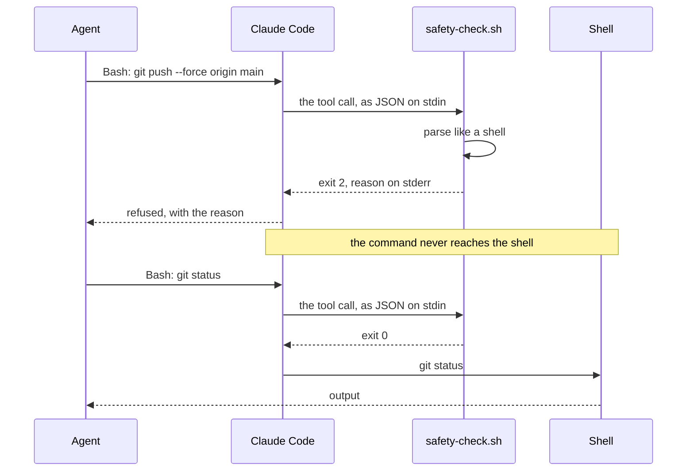
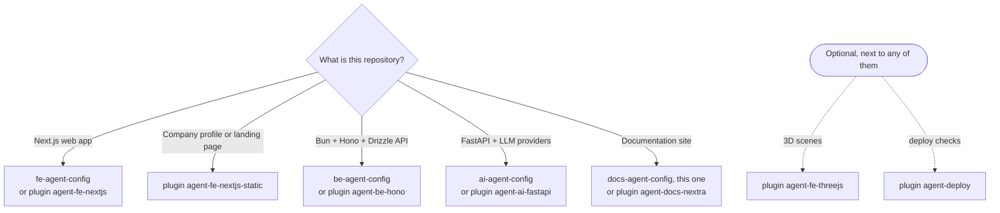
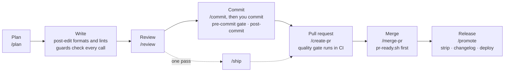
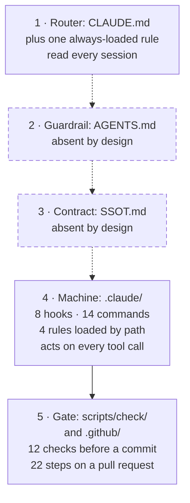

**English** | [Bahasa Indonesia](README.id.md)

<h1 align="center">
  <picture>
    <source media="(prefers-color-scheme: dark)" srcset="docs/assets/banner-docs-dark.svg">
    <source media="(prefers-color-scheme: light)" srcset="docs/assets/banner-docs-light.svg">
    
  </picture>
</h1>

<p align="center">
  <a href="LICENSE"></a>
  <a href="#ci-pull-requests-only"></a>
  <a href="#prefer-plugins"></a>
</p>

**The Claude Code layer for a statically exported docs site: rules, hooks, commands and gates that
exit non-zero instead of asking nicely.** Built for Nextra on Next.js, deployed as an assets-only
Cloudflare Worker.

> [!TIP]
> **TL;DR.** Copy this layer into your docs repository, fill in the placeholders, and prove it with
> one command. From then on, Claude Code cannot hand-edit a generated page, push to `dev`, `prod`
> or `main`, read a `.env` file into the chat, or skip the pre-commit gate: each try is refused
> with exit code 2 and a reason that says what to do instead. `.env` changes and production
> database writes stay locked until *you* unlock them for a few minutes. Everything runs on your
> machine, and CI runs only on pull requests. Prefer installing to copying? Use the
> [`agent-docs-nextra` plugin](#prefer-plugins).

**Prefer plugins?** The same layer installs in three steps, with no files to copy. Inside Claude
Code:

```text
/plugin marketplace add adhibuchori/agent-config-kit
/plugin install agent-docs-nextra@agent-config-kit
/agent-docs-nextra:setup
```

Installing `agent-docs-nextra` also installs `agent-core`, which it depends on. Setup shows a dry
run and writes only when you reply **go**. [Prefer plugins?](#prefer-plugins) compares the two ways.

## Contents

1. [Why it exists](#why-it-exists): eight failures, and a before and after
2. [See it in action](#see-it-in-action)
3. [Who it is for, and who it is not for](#who-it-is-for-and-who-it-is-not-for)
4. [Choose your template or plugin](#choose-your-template-or-plugin) and
   [Prefer plugins?](#prefer-plugins)
5. [Requirements](#requirements) and [Quick start](#quick-start)
6. [A normal day with the layer](#a-normal-day-with-the-layer)
7. [What gets installed](#what-gets-installed) and [how it fits together](#how-it-fits-together)
8. [Everything this template ships](#everything-this-template-ships): [hooks](#hooks),
   [commands](#commands), [agents](#agents), [skills](#skills), [rules](#rules),
   [anti-patterns](#anti-patterns), [checks and gates](#checks-and-gates),
   [CI workflows](#ci-workflows), [config files](#config-files)
9. [Configuration](#configuration)
10. [Unlocking `.env` and the production DB](#unlocking-env-and-the-production-db)
11. [CI: pull requests only](#ci-pull-requests-only)
12. [Security model](#security-model), [what the hooks refuse](#what-the-hooks-refuse-and-how-to-turn-one-off)
    and [cost and overhead](#cost-and-overhead)
13. [Upgrade and uninstall](#upgrade-and-uninstall)
14. [Customize recipes](#customize-recipes) and
    [design decisions worth knowing](#design-decisions-worth-knowing-before-you-edit)
15. [Finished examples](#finished-examples-the-template-repos)
16. [FAQ and troubleshooting](#faq-and-troubleshooting)
17. [Glossary, roadmap and scope](#glossary-roadmap-and-scope)

---

## Why it exists

An instruction in `CLAUDE.md` is a request. A hook that exits 2 is a wall. Each story below is a
failure that happens on real docs sites, what this layer does about it, and which pieces do the
work.

1. **A hand edit to a generated page vanishes.**
   *The problem:* the SDK reference page has a typo. The agent fixes it in
   `content/technical/sdk.mdx`, the review passes, and the next `bun run docs:generate` writes the
   page again from the source comments. The fix is gone, and nobody notices for weeks.
   *The fix:* you list the pages your generators write, and every hand edit to them is refused
   with a pointer to the source.
   *Handled by:* [`generated-guard.sh`](#hooks), the [`docs-site/content.md`](#rules) rule,
   [SETUP §4](SETUP.md#point-the-generated-content-guard-at-your-output).

2. **The agent force-pushes to the branch that deploys.**
   *The problem:* a rebase went wrong, and the agent "fixes" it with
   `git push --force origin prod`. Yesterday's merged pages are gone from the live site.
   *The fix:* a push to, or the deletion of, `dev`, `prod`, `main` or `master` is refused: by
   refspec, by `--all` or `--mirror`, by the checked-out branch, from the shell and from GitHub's
   MCP tools. Work reaches `prod` through pull requests.
   *Handled by:* [`safety-check.sh`](#hooks), [`mcp-guard.sh`](#hooks), the `deny` list in
   [`.claude/settings.json`](#config-files), [`/create-pr`](#commands), [`/promote`](#commands).

3. **A secret lands in the transcript.**
   *The problem:* the changelog generator fails, and "let me check your config" becomes
   `cat .env.development`. Your GitHub token is now in the chat log.
   *The fix:* no shell command may read or write a real `.env*` file, by any route the hook can
   read. Claude lists the keys through a helper that masks every secret, and changes a value only
   after you unlock `env` yourself. The Bash sandbox refuses the same reads at the operating-system
   level.
   *Handled by:* [`safety-check.sh`](#hooks), [`scripts/env/`](#checks-and-gates),
   [the unlock](#unlocking-env-and-the-production-db), the sandbox in
   [`.claude/settings.json`](#config-files).

4. **A rule in `CLAUDE.md` is ignored.**
   *The problem:* `CLAUDE.md` says "never skip the pre-commit hook". Two hours into a session, a
   lint error blocks a commit, and the agent runs `git commit --no-verify`.
   *The fix:* the rules that matter are hooks and gate lines, not prose. `--no-verify`, `HUSKY=0`
   and their cousins are refused, and the gate list runs on every commit. The other rules load only
   while a matching file is open, and a byte budget keeps the always-loaded part short enough to be
   read.
   *Handled by:* [`safety-check.sh`](#hooks), [`gates.list` and `.husky/pre-commit`](#checks-and-gates),
   [the rules](#rules), [`ai-config.sh`](#checks-and-gates).

5. **Copies drift.**
   *The problem:* the same slash command exists for two tools, and the same CI YAML in many repos. A
   fix lands in one copy; the others keep the bug, and nothing says so.
   *The fix:* every command is written once in `_workflow-source/` and mirrored, and the gate fails
   when a mirror drifts. Every action is pinned to a commit, and a pull request that changes a
   workflow is linted. For many repos, the plugin's reusable workflows keep one copy for all of
   them.
   *Handled by:* [`scripts/sync/workflows.sh`](#checks-and-gates),
   [`workflows-lint.yml`](#ci-workflows), [Prefer plugins?](#prefer-plugins).

6. **A merged pull request quietly runs nothing.**
   *The problem:* a commit message carries the skip-CI marker. The promotion to `prod` runs no
   checks and no deploy, and GitHub only shows "no checks", which looks like a slow queue.
   *The fix:* no workflow, script or command writes a skip-CI marker, merges are merge commits,
   and the merge check counts a skipped check as not passed.
   *Handled by:* [`pr-ready.sh`](#checks-and-gates), [`/merge-pr`](#commands),
   [RATIONALE §7](docs/RATIONALE.md#7-the-skip-ci-marker-that-disarms-gates-silently).

7. **Correct source comments break the MDX build.**
   *The problem:* a source comment says `Array<string>` or `{id}`. The generator copies it into a
   page, and MDX reads it as a tag or an expression. The build fails on text that was never wrong.
   *The fix:* escape at render time, not at write time. The content rule and SETUP §6 name the two
   traps, and the anti-pattern index lists the known build breakers.
   *Handled by:* [`docs-site/content.md`](#rules),
   [SETUP §6](SETUP.md#the-two-escaping-traps),
   [RATIONALE §10](docs/RATIONALE.md#10-text-that-is-hostile-to-the-mdx-build).

8. **The agent wipes someone else's work.**
   *The problem:* two sessions share one checkout. One runs `git reset --hard` or a bare
   `git stash` to "start clean", or `rm -rf content`.
   *The fix:* commands that wipe uncommitted work or delete protected paths are refused, commits go
   by pathspec, and after every commit Claude is shown exactly which files it carried.
   *Handled by:* [`safety-check.sh`](#hooks), [`post-commit.sh`](#hooks),
   [`/checkpoint`](#commands).

<details>
<summary><strong>Before and after: the same five minutes, without and with the layer</strong></summary>

### Without the layer

```text
You:     The SDK page has a typo in the auth section, and the changelog job failed. Fix both.
Claude:  Edit content/technical/sdk.mdx                  ← the next docs:generate erases it
Claude:  Checking the token.        $ cat .env.development
         GITHUB_TOKEN=ghp_…                              ← the token is now in the chat
Claude:  Lint fails on an old file, committing anyway.   $ git commit --no-verify -m "fix typo"
Claude:  $ git push --force origin prod                  ← straight to the branch that deploys
```

### With the layer

```text
You:     The SDK page has a typo in the auth section, and the changelog job failed. Fix both.
Claude:  Edit content/technical/sdk.mdx
         [generated-guard] BLOCKED: content/technical/sdk.mdx is generated output
         (content/technical in generatedPaths).
         Change its source and run the project's generator instead of editing it.
Claude:  The typo is in a source comment in the application repo. Here is the one-line fix
         there; then I re-run `bun run docs:generate`.
Claude:  $ cat .env.development
         [safety] BLOCKED: .env.development holds secrets, and the shell never reads or writes
         a real .env* file directly: … List its keys with
         `bash scripts/env/show.sh .env.development` (secret values masked). …
Claude:  $ bash scripts/env/show.sh .env.development
         .env.development: 6 keys
           GITHUB_TOKEN     ghp_…(42 chars)
           …
         The token is set, so the job failed for another reason. To replace the token, you would
         first run `! bun unlock env` yourself.
Claude:  $ git commit --no-verify -m "fix typo"
         [safety] BLOCKED: skipping the pre-commit gate is not allowed. Fix what it reports.
Claude:  $ git push --force origin prod
         [safety] BLOCKED: pushing to a protected branch (dev/prod/main/master) is not allowed. …
Claude:  $ git push -u origin internal/sdk-typo      (allowed; then /create-pr)
```

The refusals are the hooks' real messages, captured in a fresh copy of this template (shortened
with `…`). The lines around them show where they appear in a session.

</details>

---

## See it in action

<picture>
  <source media="(prefers-color-scheme: dark)" srcset="docs/assets/demo-blocked-dark.svg">
  <source media="(prefers-color-scheme: light)" srcset="docs/assets/demo-blocked-light.svg">
  
</picture>

This is what the hook really sends back. Claude Code hands the hook the tool call as JSON; the hook
answers with exit code 2 and a reason on stderr, which Claude reads and acts on:

```text
tool call  Bash  {"command": "git push --force origin main"}
exit 2     [safety] BLOCKED: pushing to a protected branch (dev/prod/main/master) is not allowed.
           Push your work branch and open a PR; when a release needs this push, the user runs it
           with `!`.

tool call  Bash  {"command": "git status"}
exit 0     (nothing: the command runs)
```

Run the same thing yourself, from the root of a repository that has the layer:

```bash
echo '{"tool_name":"Bash","tool_input":{"command":"git push --force origin main"}}' |
  bash .claude/hooks/safety-check.sh; echo "exit $?"    # the reason on stderr, then: exit 2
echo '{"tool_name":"Bash","tool_input":{"command":"git status"}}' |
  bash .claude/hooks/safety-check.sh; echo "exit $?"    # exit 0
```

<picture>
  <source media="(prefers-color-scheme: dark)" srcset="docs/assets/hook-flow-dark.svg">
  <source media="(prefers-color-scheme: light)" srcset="docs/assets/hook-flow-light.svg">
  
</picture>



The banner, the demo, the hook flow and the unlock flow are animated with CSS only: the hedgehog
blinks, the command types in, the lock opens and closes. When your system asks for reduced motion,
each one shows a still picture instead.

---

## Who it is for, and who it is not for

<picture>
  <source media="(prefers-color-scheme: dark)" srcset="docs/assets/mascot-dark.svg">
  <source media="(prefers-color-scheme: light)" srcset="docs/assets/mascot-light.svg">
  
</picture>

**A good fit if you:**

- run a documentation site that is statically exported, ideally Nextra on Next.js, and let
  Claude Code (the CLI or an IDE extension) work in it;
- generate some pages from another repository (an API reference, a changelog) and hand-write the
  rest;
- want refusals you can read, test and switch off, not advice in a prompt.

**Not a fit if you:**

- need a starter site: there is no `content/`, `app/`, `package.json` or lockfile here, only the
  agent layer around your site;
- build an application that happens to have docs pages: it owns domain logic, so
  [`fe-agent-config`](https://github.com/adhibuchori/fe-agent-config) fits better;
- want a security boundary against a hostile agent: the hooks read command text and are a
  guardrail against slips and injected instructions (see [Security model](#security-model));
- work with an AI tool other than Claude Code: the rules, gates and scripts carry over, but the
  hook wiring in `.claude/settings.json` and the `.mcp.json` format are Claude Code's.

---

## Choose your template or plugin

Every stack has a template repository (plain files, like this one) or a plugin in
[agent-config-kit](https://github.com/adhibuchori/agent-config-kit). Pick one per repository.



| Your repository | Template repository | Plugin |
| :-- | :-- | :-- |
| Next.js web app | [fe-agent-config](https://github.com/adhibuchori/fe-agent-config) | `agent-fe-nextjs` |
| Company profile or landing page | — | `agent-fe-nextjs-static` |
| Bun + Hono + Drizzle API | [be-agent-config](https://github.com/adhibuchori/be-agent-config) | `agent-be-hono` |
| FastAPI service with LLM providers | [ai-agent-config](https://github.com/adhibuchori/ai-agent-config) | `agent-ai-fastapi` |
| **Documentation site** | **docs-agent-config (this one)** | **`agent-docs-nextra`** |
| Add-on: three.js or React Three Fiber scenes | — | `agent-fe-threejs` |
| Add-on: deploy checks, any host | — | `agent-deploy` |

---

## Prefer plugins?

<picture>
  <source media="(prefers-color-scheme: dark)" srcset="docs/assets/install-flow-dark.svg">
  <source media="(prefers-color-scheme: light)" srcset="docs/assets/install-flow-light.svg">
  :setup, which shows a dry run before it
    applies anything.">
</picture>

The same layer ships as Claude Code plugins in
[**agent-config-kit**](https://github.com/adhibuchori/agent-config-kit). This template's plugin is
**`agent-docs-nextra`**; it depends on `agent-core`, which carries the shared hooks, rules and
commands. Add the marketplace once, in a terminal:

```bash
claude plugin marketplace add adhibuchori/agent-config-kit
```

Then, inside Claude Code, install it and run its setup in your docs repository:

```text
/plugin install agent-core@agent-config-kit
/plugin install agent-docs-nextra@agent-config-kit
/agent-docs-nextra:setup
```

Setup asks a few questions, shows a dry run of every file it would write, and writes only when you
reply **go**. A plugin cannot carry permissions or `.claude/rules/`, so setup writes those into your
repository, with a lock file that turns the hooks on for everyone who clones it.

| | Copied as files (this template) | Installed as a plugin |
| :-- | :-- | :-- |
| Where the hooks live | in your repository, reviewed in your pull requests | in the installed plugin |
| When they run | always | only in a repository that opted in (`.claude/agent-config.json` or `.claude/agent-config-kit.lock`) |
| Updates | you pull and copy ([Upgrade](#upgrade-and-uninstall)) | `claude plugin marketplace update agent-config-kit`, `claude plugin update agent-docs-nextra@agent-config-kit`, then `/agent-docs-nextra:sync` |
| Where it works | anywhere Claude Code reads project settings | Claude Code; claude.ai and Cowork do not install plugins with a `bin/` folder, which `agent-core` needs for setup |

Use one or the other in a repository, not both: a copied layer already wires the hooks in
`.claude/settings.json`, and the plugin would run them a second time.
`/agent-docs-nextra:sync --check` reports that as double wiring.

---

## Requirements

The first row is what the hooks need. Every other row belongs to one part of the layer, and
[SETUP §1](SETUP.md#tools) says what happens when its tool is missing.

| For | You need |
| :-- | :-- |
| Hooks, commands, subagents | Claude Code, bash 3.2 or newer (macOS `/bin/bash` is fine), git, python3 3.8 or newer; jq is optional |
| The Bash sandbox under the hooks (on by default) | macOS; Linux or WSL2 with `bubblewrap` and `socat`. Not WSL1 or native Windows: there Claude Code warns and runs commands without it, and `"sandbox": {"enabled": false}` turns it off |
| The gates | The package scripts in SETUP §5, husky, Bun, Node 20 or newer, and SkillSpector 2.11.2 (installed with `uv`) |
| The MCP servers as shipped | `uv` (`uvx`) for Serena and the two database servers, `npx` for Context7, your own token for GitHub |
| `/merge-pr`, `/promote`, `pr-ready.sh` | `gh`, signed in |
| The secret scan on your machine | gitleaks; CI fetches a pinned build itself |
| `ci-cd.yaml` as shipped | A Cloudflare account and `wrangler.jsonc`; replace the workflow if you deploy elsewhere |
| `changelog.yaml` | A separate application repository and a token that can read it |

---

## Quick start

Steps 1 to 7 are the minimum; [SETUP.md](SETUP.md) has the full path, about forty minutes.

1. **Clone this repository next to your docs site**, from the folder that holds it:

   ```bash
   git clone https://github.com/adhibuchori/docs-agent-config.git
   cd your-docs-site
   CFG=../docs-agent-config
   ```

2. **Copy the layer in**, without this repository's own `README.md`, `README.id.md`, `SETUP.md`,
   `LICENSE`, `docs/assets/` and `.markdownlint-cli2.jsonc`:

   ```bash
   cp -R "$CFG"/{.claude,.agent,_workflow-source,.github,.husky,scripts} .
   cp "$CFG"/{CLAUDE.md,.mcp.json,oxlint.json,.oxlintignore,.oxfmtrc.json,knip.ts,doctor.config.json} .
   cp "$CFG"/{.gitleaks.toml,.skillspector-baseline.yaml,wrangler.example.jsonc} .
   mkdir -p docs && cp "$CFG"/docs/{unlock.md,RATIONALE.md} docs/
   ```

   Copy `.env.development.example` and `.env.production.example` too, unless you already have env
   templates; then merge their keys into yours.

3. **Merge `.gitignore` into yours** before the first commit. `.claude/state/` and every real
   `.env*` file must be ignored. Append it, remove any duplicate lines, then check:

   ```bash
   cat "$CFG"/.gitignore >> .gitignore
   git check-ignore .claude/state/unlock/env .env.production   # prints both paths
   ```

4. **Fill in the placeholders.** [SETUP §2](SETUP.md#2-fill-in-every-placeholder) lists the files
   that hold them: the project name, the generated pages, the application repository and the deploy
   target. This grep shows every one, next to usage syntax such as `<file>` that stays as written:

   ```bash
   grep -rn '<[a-zA-Z][a-zA-Z -]*>' CLAUDE.md .mcp.json .claude/ .github/ _workflow-source/
   ```

5. **Tell the generated-page guard what your generators write**, in `.claude/agent-config.json`,
   and check that it holds:

   ```bash
   echo '{ "generatedPaths": ["content/technical", "content/changelog.mdx"] }' > .claude/agent-config.json
   echo '{"tool_name":"Edit","tool_input":{"file_path":"content/technical/api.mdx"}}' |
     bash .claude/hooks/generated-guard.sh; echo "exit $?"   # BLOCKED …, then: exit 2
   ```

6. **Add the package scripts and dev dependencies** from
   [SETUP §5](SETUP.md#5-make-the-gate-runnable), the `unlock` alias and `"prepare": "husky"`
   included, then run `bun install`. TypeScript is pinned to 6.0.3 there, because the Nextra build
   fails on TypeScript 7. Add `"types": ["bun"]` under `compilerOptions` in `tsconfig.json`, or the
   type check fails on the Bun scripts in `scripts/`; SETUP §5 also covers the CSS import the
   theme needs.

7. **Prove it.** Commit or stage the layer, and run `bun run format` once so your own
   `package.json` matches the formatter. Then run the probes (a few minutes) and the gate,
   which runs every line of the list:

   ```bash
   /bin/bash scripts/check/hook-probes.sh   # hook probes: 1797 passed, 0 failed
   bash scripts/check/gates.sh              # 12 gate(s) ran, 0 failed
   ```

**Next:** open a session and ask the agent to edit a generated page. It is refused. That is the
general remedy whenever a rule does not hold: move it from prose into a hook or a gate line.
[SETUP.md](SETUP.md) walks through the rest, including the GitHub settings the workflows need. The
one step that can delete files, the production strip, comes last on purpose.

---

## A normal day with the layer

Each step names the command you run and what helps without being asked.



| Step | You run | What helps by itself |
| :-- | :-- | :-- |
| Plan | `/plan add SDK reference section` | The rules for the files the plan reads load by path, such as [`docs-site/content.md`](.claude/rules/docs-site/content.md) for `content/` |
| Write | Nothing special: ask for the change | [`generated-guard.sh`](#hooks) refuses edits to generated pages, [`safety-check.sh`](#hooks) refuses what should not run, and [`post-edit.sh`](#hooks) formats and lints each written file |
| Debug | `/rca broken anchor on SDK page`, or `/debug …` | [`prompt-intent.sh`](#hooks) routes `/debug` to `/rca`; the [anti-pattern index](#anti-patterns) is checked first |
| Review | `/review`; for header or metadata changes, also ask for `agents-security-guard` or `agents-seo-validator` | `/review` reads the review checklist, so nothing loads it every session |
| Commit | `/commit`, then `git commit -- <paths>` | `.husky/pre-commit` runs the gates the staged files need; [`post-commit.sh`](#hooks) shows what the commit carried |
| Pull request | `/create-pr` | [Quality Gate, React Doctor, CodeQL, dependency review and the AI review](#ci-workflows) run on the pull request |
| Review comments | `/resolve-pr-review 42` | Each comment is triaged with you before anything changes |
| Merge | `/merge-pr 42` | [`pr-ready.sh`](#checks-and-gates) blocks on a failed, pending or skipped check |
| Release | `/promote`, then `/branch-cleanup` | [`strip-ai-on-pr.yml`, `changelog.yaml` and `ci-cd.yaml`](#ci-workflows) strip, regenerate and deploy |
| End of session | `/checkpoint-summary`, `/learn-session` | A lesson is written into the rule or check that loads next time |

---

## What gets installed

What lands in your repository after the Quick start. Your own site files (`content/`, `app/`,
`package.json`, …) stay yours; the layer only adds these.

```text
your-docs-site/
├── CLAUDE.md                    the router Claude reads every session (115 lines); fill it in
├── .mcp.json                    MCP servers, each pinned to a release; tokens come from your shell
├── .gitignore                   yours, plus the layer's lines: .claude/state/, real .env* files
├── .gitleaks.toml               secret-scan settings: the default rules, one exact exception
├── .skillspector-baseline.yaml  the SkillSpector triage record, one entry per accepted finding
├── oxlint.json, .oxlintignore   lint rules, and what the linter skips
├── .oxfmtrc.json                formatter settings (content/, scripts/ and *.md are skipped)
├── knip.ts                      dead-code entry points for a Nextra site
├── doctor.config.json           React Doctor settings: its dead-code check is off, Knip does it
├── wrangler.example.jsonc       an assets-only Worker; copy to wrangler.jsonc and fill in
├── .env.*.example               the env templates, placeholders only
├── .husky/pre-commit            runs the gate list on every commit
├── .claude/
│   ├── settings.json            hook wiring, allow/ask/deny permissions, the Bash sandbox
│   ├── agent-config.json        your hook settings (generatedPaths); the .example lists them all
│   ├── hooks/                   8 hooks + lib.sh + README.md (what each refuses and why)
│   ├── rules/                   5 rules: 1 always loaded, 4 loaded by path
│   ├── commands/                14 slash commands + INDEX.md, mirrored from _workflow-source/
│   ├── agents/                  2 review subagents + INDEX.md
│   ├── anti-patterns/           9 known traps + INDEX.md with trigger keywords
│   ├── docs/                    the review checklist /review reads
│   ├── mcp/                     3 on-demand MCP server templates
│   └── *.example.md             4 on-demand references to fill in or delete
├── .agent/workflows/            the same 14 commands, for a second tool (delete if unused)
├── _workflow-source/            where you edit the commands: 14 sources + INDEX.md
├── scripts/
│   ├── check/                   the gates: gates.list, gates.sh, the checks, the hook probes
│   ├── env/                     show.sh, set.sh, envfile.py: the masked .env helpers
│   ├── next/                    run.mjs (starts Next.js) and env.ts (env preflight)
│   ├── ops/                     unlock.sh (yours to run) and pr-ready.sh (merge check)
│   └── sync/workflows.sh        mirrors the commands; --check reports drift
├── .github/
│   ├── workflows/               9 workflows, all started by pull-request events
│   ├── scripts/                 the CI gate, the comment checks, the production strip
│   ├── PULL_REQUEST_TEMPLATE/   dev.md for work, promotion.md for dev → prod
│   └── CODEOWNERS               review requests for the files that guard production
└── docs/
    ├── unlock.md                how you open .env* changes and production writes
    └── RATIONALE.md             why the odd-looking parts are shaped that way
```

What stays behind in this repository: `README.md`, `README.id.md`, `SETUP.md`, `LICENSE`,
`docs/assets/` and `.markdownlint-cli2.jsonc`, which describe the template itself.

---

## How it fits together

<picture>
  <source media="(prefers-color-scheme: dark)" srcset="docs/assets/layers-dark.svg">
  <source media="(prefers-color-scheme: light)" srcset="docs/assets/layers-light.svg">
  
</picture>

The four templates share one five-layer model. **A docs site ships three of them**: layers 2 and 3
are absent by design, because a docs site has no domain logic for `AGENTS.md` to guard and no
product for `SSOT.md` to describe. `CLAUDE.md` says so in its second paragraph.



What the absences change, compared with the application templates:

| | Application templates | This docs template |
| :-- | :-- | :-- |
| `AGENTS.md`, numbered rules | yes | **absent by design** |
| `SSOT.md`, the architecture contract | yes | **absent by design** |
| Rules | `common/`, their language's folder, plus stack tiers (`web/`, `backend/`) | **`common/`, `typescript/`, plus one `docs-site/` rule** |
| Hooks | the shared set, plus a guard for their generated code or migrations | **the shared set, plus the generated-page guard** |
| Tests and coverage | a 100% coverage gate | **none: a docs site has no test suite** |
| Deploy | the platform of your choice | **an assets-only Cloudflare Worker** |
| Extra workflow | — | **`changelog.yaml`**, a content pipeline fed by the application repository |

---

## Everything this template ships

Counted with `git ls-files`: **154 files. No `AGENTS.md`, no `SSOT.md`, no application source.**
Each table answers three questions for every piece: what it does, how you use it, and why it helps.
Each name links to the file or to the page that explains it.

### Hooks

Eight hooks and a shared library, wired in `.claude/settings.json`. **Guards** (PreToolUse) can
refuse a call with exit 2; **feedback hooks** only add context and never block. The full contract,
the fail modes and every refusal are in [`.claude/hooks/README.md`](.claude/hooks/README.md). Each
**It's working if** link opens that hook's page in the plugin repo, which ends with a check you can
run to see it work.

| Name | What it does | How to use | Why it helps |
| :-- | :-- | :-- | :-- |
| [`safety-check.sh`](.claude/hooks/README.md#what-safety-checksh-refuses) | Refuses destructive commands, pushes to protected branches, skipped pre-commit gates, any shell read or write of a real `.env*` file, the unlock, risky git settings, and any command it cannot resolve | Automatic, before every `Bash` call (guard, 10 s) · [It's working if](https://github.com/adhibuchori/agent-config-kit/blob/main/docs/agent-core/safety-check.md#its-working-if) | The command you would regret never runs, and the refusal says what to do instead |
| [`db-guard.sh`](.claude/hooks/README.md#the-hooks) | Lets one read-only SQL statement through; holds every write until you unlock `db` | Automatic, before `mcp__db-prod__execute_sql` (guard, 10 s) · [It's working if](https://github.com/adhibuchori/agent-config-kit/blob/main/docs/agent-core/db-guard.md#its-working-if) | No surprise `DELETE` against production from a "quick cleanup" |
| [`mcp-guard.sh`](.claude/hooks/README.md#the-hooks) | Refuses `push_files`, `create_or_update_file`, `delete_file` and `create_branch` onto a protected branch | Automatic, before those four GitHub MCP tools (guard, 10 s) · [It's working if](https://github.com/adhibuchori/agent-config-kit/blob/main/docs/agent-core/mcp-guard.md#its-working-if) | Closes the route around the shell guard |
| [`generated-guard.sh`](.claude/hooks/README.md#the-hooks) | Refuses hand edits to the paths in `generatedPaths` | Automatic, before `Write`, `Edit`, `MultiEdit` and Serena's write tools (guard, 10 s); list your paths in `.claude/agent-config.json` · [It's working if](https://github.com/adhibuchori/agent-config-kit/blob/main/docs/agent-docs-nextra/generated-guard.md#its-working-if) | The fix goes into the source, not into a page the next generator run overwrites |
| [`post-commit.sh`](.claude/hooks/README.md#the-hooks) | Shows what a commit carried, and warns about paths its pathspec did not name | Automatic, after a `Bash` call that commits (feedback, 20 s) · [It's working if](https://github.com/adhibuchori/agent-config-kit/blob/main/docs/agent-core/post-commit.md#its-working-if) | Another session's staged files cannot ride along unseen |
| [`post-edit.sh`](.claude/hooks/README.md#the-hooks) | Formats, then lints, the file just written, with your own `oxfmt` and `oxlint` | Automatic, after every write tool (feedback, 60 s) · [It's working if](https://github.com/adhibuchori/agent-config-kit/blob/main/docs/agent-core/post-edit.md#its-working-if) | Findings are fixed in the next edit, not at commit time |
| [`prompt-intent.sh`](.claude/hooks/README.md#the-hooks) | Points `/debug` at this repo's `/rca`; prunes session state idle for two days | Type `/debug <symptom>` (feedback, 10 s) · [It's working if](https://github.com/adhibuchori/agent-config-kit/blob/main/docs/agent-core/prompt-intent.md#its-working-if) | Debugging starts from a reproduction, not from a guess |
| [`session-start.sh`](.claude/hooks/README.md#the-hooks) | Makes the zsh that runs Claude's commands behave like bash on unmatched globs, `=word` and word splitting | Automatic, at session start (feedback, 10 s) · [It's working if](https://github.com/adhibuchori/agent-config-kit/blob/main/docs/agent-core/session-start.md#its-working-if) | Fewer confusing failures such as `no matches found` |
| [`lib.sh`](.claude/hooks/README.md#the-contract) | The shared helpers, the config loader, and the analyzer that reads a command the way a shell does | Sourced by the hooks; you never run it | One parser, so every hook judges a command the same way |

Check each guard yourself from the repository root. Every line prints the reason and `exit 2`,
except the last, which prints `exit 0`:

```bash
echo '{"tool_name":"Bash","tool_input":{"command":"cat .env.production"}}' |
  bash .claude/hooks/safety-check.sh; echo "exit $?"
echo '{"tool_name":"mcp__db-prod__execute_sql","tool_input":{"sql":"DELETE FROM users"}}' |
  bash .claude/hooks/db-guard.sh; echo "exit $?"
echo '{"tool_name":"mcp__github__push_files","tool_input":{"branch":"main","files":[]}}' |
  bash .claude/hooks/mcp-guard.sh; echo "exit $?"
echo '{"tool_name":"Edit","tool_input":{"file_path":"content/technical/api.mdx"}}' |
  bash .claude/hooks/generated-guard.sh; echo "exit $?"   # exit 0 until Quick start step 5
echo '{"tool_name":"mcp__db-prod__execute_sql","tool_input":{"sql":"SELECT 1"}}' |
  bash .claude/hooks/db-guard.sh; echo "exit $?"
```

### Commands

Fourteen slash commands, in the order work flows. You edit them once in
[`_workflow-source/`](_workflow-source/INDEX.md) and run `bash scripts/sync/workflows.sh`, which
mirrors them into `.claude/commands/` and `.agent/workflows/`.

| Name | What it does | How to use | Why it helps |
| :-- | :-- | :-- | :-- |
| [`/plan`](_workflow-source/plan.md) | Scopes a content or feature change, breaks it into tasks and names the risks | `/plan add SDK reference section` | You agree on the scope before a page is written |
| [`/rca`](_workflow-source/rca.md) | Reproduces a bug first, finds the line that causes it, and fixes it with a test that fails without the fix; commits nothing | `/rca broken anchor on SDK page`, or `/debug …` | No fix by guesswork, and the proof stays |
| [`/checkpoint`](_workflow-source/checkpoint.md) | A local safety commit of this session's files, by pathspec; never pushes | `/checkpoint before nav restructure` | A risky change can be undone in one step |
| [`/review`](_workflow-source/review.md) | Reviews the staged changes for content quality, broken links, the build, accessibility and structure; offers to apply the fixes | `/review` | Broken links and a failing build are caught before the commit |
| [`/commit`](_workflow-source/commit.md) | Runs the gates, inspects the staged changes and drafts a commit message; you commit | `/commit` | Every commit message follows one format, after a green gate |
| [`/ship`](_workflow-source/ship.md) | Stages everything, runs `/review` and `/security-review`, fixes the findings, re-runs the gates, commits and pushes the work branch; refuses on `dev` and `prod` | `/ship` | From written to pushed in one pass, with no finding skipped |
| [`/create-pr`](_workflow-source/create-pr.md) | Drafts the pull request title and description and opens it into `dev` once you confirm | `/create-pr` | Every pull request has the same shape and a real description |
| [`/resolve-pr-review`](_workflow-source/resolve-pr-review.md) | Fetches the review comments, triages them with you, and applies the accepted ones | `/resolve-pr-review 42` | No comment is lost, and none is applied blindly |
| [`/merge-pr`](_workflow-source/merge-pr.md) | Checks readiness with `pr-ready.sh`, merges with a merge commit, and deletes an `internal/*` head by name | `/merge-pr 42` | A skipped or failed check blocks the merge |
| [`/promote`](_workflow-source/promote.md) | Takes `internal/*` to `dev` to `prod` through pull requests, audits the production env, and verifies the deploy by timestamp | `/promote` | "Done" means production changed, not that a merge happened |
| [`/promote-deploy`](_workflow-source/promote-deploy.md) | The same promotion without pull requests, for when CI cannot run; you push, and it logs what CI still owes | `/promote-deploy` | A release is still possible on a day Actions is down, with a record |
| [`/branch-cleanup`](_workflow-source/branch-cleanup.md) | After a promotion, deletes merged branches once you confirm the list; keeps unmerged ones | `/branch-cleanup` | The remote keeps `dev`, `prod` and open work, not fifty stale branches |
| [`/checkpoint-summary`](_workflow-source/checkpoint-summary.md) | A handover summary: done, pending, next | `/checkpoint-summary docs-sprint` | The next session, or the next person, starts where this one stopped |
| [`/learn-session`](_workflow-source/learn-session.md) | Writes each lasting lesson into the rule, check or anti-pattern that will load again | `/learn-session` | A mistake is corrected once, not every session |

### Agents

Two review subagents. They run on the Haiku model, only report, and change no files. Their
descriptions do not ask Claude to use them proactively, so ask for one by name.

| Name | What it does | How to use | Why it helps |
| :-- | :-- | :-- | :-- |
| [`agents-security-guard`](.claude/agents/agents-security-guard.md) | Reviews response headers and CSP, secrets that could reach the static export, raw HTML and XSS, and the Worker's public addresses | "Use the agents-security-guard subagent on this change" | A token baked into the export is found before it is public |
| [`agents-seo-validator`](.claude/agents/agents-seo-validator.md) | Reviews page metadata, the heading outline, the favicon, and the robots and sitemap files | "Use the agents-seo-validator subagent on the layout change" | Search results and link previews keep working after a layout change |

### Skills

| Name | What it does | How to use | Why it helps |
| :-- | :-- | :-- | :-- |
| none shipped | The commands above cover the workflow, so this template adds no skills | Add your own under `.claude/skills/<name>/SKILL.md` | [`skills.sh`](#checks-and-gates) scans every skill you add with SkillSpector, so a third-party skill is checked like any other dependency |

### Rules

Rules are Markdown instructions Claude Code loads by itself. One loads in every session; the others
load only while Claude works on a matching file, so they cost nothing the rest of the time.

| Name | What it does | How to use | Why it helps |
| :-- | :-- | :-- | :-- |
| [`common/working-agreements.md`](.claude/rules/common/working-agreements.md) | How work is done: evidence, scope, order of work, shared checkouts | Loads in every session | Each correction is made once, not in every session |
| [`common/folder-shape.md`](.claude/rules/common/folder-shape.md) | Where files go: no loose files next to folders, tests mirror their source, no "misc" folders | Loads for `scripts/`, `components/`, `lib/`, `src/`, `tests/`; `folder-shape.mjs` enforces it | A file's path stays guessable |
| [`typescript/types.md`](.claude/rules/typescript/types.md) | No explicit `any`, no `as unknown as`, and what to write instead | Loads for `.ts`, `.tsx`, `.mts`, `.cts` | The type checker keeps doing its job |
| [`typescript/dead-code.md`](.claude/rules/typescript/dead-code.md) | Knip, and what counts as dead code | Loads for `.ts`, `.tsx`, `.mts`, `.cts` and `.mjs` files, `knip.ts` and `package.json` | Unused exports and dependencies go, instead of piling up |
| [`docs-site/content.md`](.claude/rules/docs-site/content.md) | Generated versus hand-written pages, accuracy against the documented repo, MDX escaping, the static export | Loads for `content/`, `components/`, `app/`, `scripts/generate/` and the site config; fill in its placeholders | Pages stay true to the code they describe, and the build stays static |
| [`code-review-checklist.md`](.claude/docs/code-review-checklist.md) | The review checklist, with a docs-site section (a reference, not a rule) | `/review` reads it; nothing loads it every session | A thorough review without a bigger always-loaded context |

### Anti-patterns

Each file records one trap: the symptom, the cause, the fix. [`INDEX.md`](.claude/anti-patterns/INDEX.md)
maps trigger keywords to files, `/rca` reads it first, and `/learn-session` adds new ones.

| Name | What it does | How to use | Why it helps |
| :-- | :-- | :-- | :-- |
| [`nextra-zod-v4-bug.md`](.claude/anti-patterns/nextra-zod-v4-bug.md) | Records the Nextra release whose layout schema breaks under Zod v4 | Read before changing the `nextra` or `nextra-theme-docs` version | A schema error that is not yours is recognised at once |
| [`nodejs-25-webstorage-ssr.md`](.claude/anti-patterns/nodejs-25-webstorage-ssr.md) | Records how Node 25's built-in `localStorage` crashes server rendering | Read on a local dev or build failure on Node 25 or newer | Explains why `scripts/next/run.mjs` adds a flag |
| [`oxfmt-rewrites-generated-files.md`](.claude/anti-patterns/oxfmt-rewrites-generated-files.md) | Records how the formatter rewrites generated pages unless it ignores them | Read when generated pages differ after a format run | Regeneration stops producing noise diffs |
| [`bun-build-vs-bun-run-build.md`](.claude/anti-patterns/bun-build-vs-bun-run-build.md) | Records that `bun build` and `bun test` are not your package scripts | Read before any `bun build` or `bun test` | The build runs your script, not Bun's bundler |
| [`a-check-that-matches-nothing-passes.md`](.claude/anti-patterns/a-check-that-matches-nothing-passes.md) | Records how a check whose scanner matched nothing reports success | Read when writing or trusting a check script | A green check means something |
| [`max-lines-skips-blanks-and-comments.md`](.claude/anti-patterns/max-lines-skips-blanks-and-comments.md) | Records why `wc -l` disagrees with the linter's line limit | Read when a file is "over the limit" but the linter is quiet | Only the linter's count decides |
| [`commit-message-skip-ci-substring.md`](.claude/anti-patterns/commit-message-skip-ci-substring.md) | Records how the skip-CI marker anywhere in a message silences every workflow | Read on a pull request with no checks | A silent merge is recognised for what it is |
| [`shared-git-index-across-sessions.md`](.claude/anti-patterns/shared-git-index-across-sessions.md) | Records how sessions in one checkout share one git index | Read when a commit carries files you did not stage | Explains why commits go by pathspec |
| [`git-apply-check-passes-then-deletes.md`](.claude/anti-patterns/git-apply-check-passes-then-deletes.md) | Records how `git apply --check` passes and the patch then deletes files | Read before applying a patch built with `git diff --no-index` | No files lost to a patch that "checked out fine" |

### Checks and gates

`scripts/check/gates.list` is the gate: twelve lines, one command each. `.husky/pre-commit` runs it
through `gates.sh` on every commit, choosing the lines the staged files need; CI runs the same
checks and more in 22 steps.

| Name | What it does | How to use | Why it helps |
| :-- | :-- | :-- | :-- |
| [`gates.sh`](scripts/check/gates.sh) + [`gates.list`](scripts/check/gates.list) | Runs every gate in the list: one log per gate, a table at the end, the tail of each failure | `bash scripts/check/gates.sh`; `--paths <files>` limits format and lint to your files; pre-commit runs `--hook --fail-fast` | Your machine and the commit hook run one list, so they cannot disagree |
| [`ai-config.sh`](scripts/check/ai-config.sh) | Keeps `CLAUDE.md` plus the always-loaded rules under 15,000 bytes, keeps `@` imports out of `CLAUDE.md`, checks every wired hook exists and every MCP server is pinned | `bash scripts/check/ai-config.sh` (a gate) | The always-loaded context stays small, and a renamed hook cannot silently stop running |
| [`ai-config-probes.sh`](scripts/check/ai-config-probes.sh) | Proves the MCP pin rule both ways, in a temp repo | `bash scripts/check/ai-config-probes.sh` (a gate) | The pin check cannot quietly pass everything |
| [`hook-probes.sh`](scripts/check/hook-probes.sh) + [`hook-probes.tsv`](scripts/check/hook-probes.tsv) | Feeds every hook the JSON Claude Code sends and checks exit code and message: 1,797 probes, fail modes and worktrees included | `/bin/bash scripts/check/hook-probes.sh` (a few minutes; a gate when a hook file is staged) | Every rule is proven to block what it must and to allow what it must |
| [`skills.sh`](scripts/check/skills.sh) | Scans commands, subagents, hooks and skills with SkillSpector, pinned to one commit, against `.skillspector-baseline.yaml` | `bash scripts/check/skills.sh --staged` (a gate) | A prompt-injection line in a command is caught like a vulnerable dependency |
| [`double-assertion.sh`](scripts/check/double-assertion.sh) | Refuses `as unknown as` in TypeScript | `bash scripts/check/double-assertion.sh` (a gate) | The compiler's type check cannot be switched off quietly |
| [`folder-shape.mjs`](scripts/check/folder-shape.mjs) | Reports folder-shape violations SHAPE-1 to SHAPE-4 | `node scripts/check/folder-shape.mjs` (a gate); `--warn` only reports | The tree stays navigable as it grows |
| [`audit.ts`](scripts/check/audit.ts) | Wraps `bun audit` and fails on a high or critical advisory for an installed version | `bun run scripts/check/audit.ts` (CI step "Security Audit") | An unreadable security report never counts as a pass |
| [`scripts/sync/workflows.sh`](scripts/sync/workflows.sh) | Mirrors `_workflow-source/` into both command folders; `--check` only verifies | `bash scripts/sync/workflows.sh --check` (a gate) | A command edited in one copy only is caught |
| [`scripts/ops/pr-ready.sh`](scripts/ops/pr-ready.sh) | Says whether a pull request can merge: its checks, mergeability, unresolved threads, branch flow; reads only | `bash scripts/ops/pr-ready.sh 42` (`/merge-pr` and `/promote` run it) | A skipped check never counts as passed |
| [`scripts/ops/unlock.sh`](scripts/ops/unlock.sh) | Opens `env` or `db` for a few minutes, shows what is open, locks again | `! bun unlock env` — only you, never the agent | Secrets open only when you decide, and close by themselves |
| [`scripts/env/show.sh`](scripts/env/show.sh) | Lists a `.env` file's keys with every secret masked, and the keys missing against its template | `bash scripts/env/show.sh .env.development` | Claude can debug config without seeing a secret |
| [`scripts/env/set.sh`](scripts/env/set.sh) | Sets one key from stdin while `env` is unlocked; backs the file up and logs only the key name | `printf '%s' "$VALUE" \| bash scripts/env/set.sh .env.development GITHUB_TOKEN` | A value changes without ever being printed |
| [`scripts/env/envfile.py`](scripts/env/envfile.py) | The parser behind `show.sh` and `set.sh` | Run through them, never alone | One reader, so masking and writing agree |
| [`scripts/next/run.mjs`](scripts/next/run.mjs) | Starts the local Next.js binary, adding `--no-experimental-webstorage` only on Node 25 or newer | The `dev` and `build` scripts call it | Node 25 cannot crash server rendering, and Node 20 still starts |
| [`scripts/next/env.ts`](scripts/next/env.ts) | Creates `.env.<target>` from its template, and checks it is complete | `bun run env:init`; `dev` and `build` run its `check` | A command stops before it starts with half a config |
| [`quality-gate.sh`](.github/scripts/quality-gate.sh) | Runs the 22 CI steps, on a runner or on your machine | `bash .github/scripts/quality-gate.sh origin/dev` | The CI gate still runs when CI cannot |
| [`check-comment-style.ts`](.github/scripts/check-comment-style.ts) | Keeps `//` comments for directives only | `bun run .github/scripts/check-comment-style.ts` (a gate) | One comment style across every script |
| [`check-comment-blocks.sh`](.github/scripts/check-comment-blocks.sh) | Caps comment runs under `.github/` at two lines | `bash .github/scripts/check-comment-blocks.sh` (a gate) | Long explanations go to `docs/RATIONALE.md`, where they are read |
| [`strip-paths.sh`](.github/scripts/strip-paths.sh), [`strip-ai.sh`](.github/scripts/strip-ai.sh), [`verify-strip.sh`](.github/scripts/verify-strip.sh), [`back-merge-prod.sh`](.github/scripts/back-merge-prod.sh) | The production strip: one list of agent files, removed from `prod`, verified on both branches, merged back into `dev` | Run by `strip-ai-on-pr.yml` and `/promote-deploy`; adopt it last ([SETUP §9](SETUP.md#9-the-ai-config-strip-pipeline--last-and-only-if-you-want-it)) | `prod` carries no agent config, and `dev` keeps it |

A commit runs only the lines its staged files need:

| Gate | Runs for a commit that stages |
| :-- | :-- |
| format and lint (`@format`) · AI config budget, hook wiring and MCP pins | anything |
| type check · no double assertion · folder shape · dead code (Knip) · comment style · comment block length · MCP pin probes | code |
| command mirror drift | commands or subagents, or code |
| hook probes | a hook, `settings.json`, the probes, `scripts/ops/unlock.sh` or `scripts/env/` |
| SkillSpector on the staged files | commands, subagents or hooks, or code |

A commit that stages only content pages, root Markdown, `.mcp.json`, a pull-request template or
another file under `.claude/` runs the first row alone.

<details>
<summary><strong>The 22 CI steps</strong> in <code>.github/scripts/quality-gate.sh</code></summary>

1. Install Dependencies
2. Format & Lint
3. Type Check
4. Dead Code Check
5. No Double Assertion
6. Folder Shape Check
7. Comment Style Check
8. Comment Block Length Check
9. Workflow Mirror Drift Check
10. AI Config Check
11. AI Config Probes
12. Hook Probes
13. Security Audit
14. Check Generated Doc TODOs (a warning, never a failure)
15. Check .env Not Committed
16. Dangerous JS APIs Check
17. Unsafe React Patterns Check
18. URL Scheme Injection Check
19. Secret Scan (gitleaks)
20. Skill Security Scan
21. Production Build
22. Check Source Maps Leak

A check that cannot run on your machine is listed as skipped in the summary, never passed silently;
on a runner, a skipped check fails the gate.

</details>

### CI workflows

Nine workflows, all started by pull-request events. None runs on a push, on a timer or by hand. They
wait for the `dev` and `prod` branches, which this repository does not have, so they are disarmed
until you create them ([SETUP §8](SETUP.md#8-github-repository-settings)).

| Name | What it does | How to use | Why it helps |
| :-- | :-- | :-- | :-- |
| [`quality-gate.yaml`](.github/workflows/quality-gate.yaml) | Runs the 22 steps of `quality-gate.sh` | Starts on a pull request into `dev` or `prod` | Nothing merges past a failing or skipped check |
| [`react-doctor.yml`](.github/workflows/react-doctor.yml) | Scores the React code, comments on the changed lines, and posts a summary | Starts on a pull request into `dev` or `prod` | React mistakes in `app/` and `components/` show up in review |
| [`deepseek-review.yml`](.github/workflows/deepseek-review.yml) | Posts an AI code review of the diff; never checks out the pull request | Starts on a pull request into `dev`, or a `/ask-deepseek` comment from someone with write access; needs `DEEPSEEK_CODE_REVIEW_TOKEN` | A second reader on every pull request |
| [`dependency-review.yml`](.github/workflows/dependency-review.yml) | Fails a pull request that adds or bumps a dependency with a known high or critical vulnerability, runtime or development | Starts on every pull request; on a private repo, only once `CODE_SECURITY` is `true` | A vulnerable package is stopped at the door |
| [`codeql.yml`](.github/workflows/codeql.yml) | CodeQL code scanning of the languages it finds | Starts on every pull request; same private-repo rule | Security bugs in code are flagged in review |
| [`workflows-lint.yml`](.github/workflows/workflows-lint.yml) | Runs actionlint (with ShellCheck), zizmor and `pinact --check` | Starts on a pull request that changes `.github/` | A workflow bug or an unpinned action is caught before merge |
| [`strip-ai-on-pr.yml`](.github/workflows/strip-ai-on-pr.yml) | Removes the agent layer from `prod`, merges `prod` back into `dev`, verifies both | Starts when a pull request into `prod` is merged | Production carries no agent config |
| [`changelog.yaml`](.github/workflows/changelog.yaml) | Regenerates the changelog and the technical pages from the application repo, commits them to `prod` and `dev`, then calls the deploy | Starts when a pull request into `prod` is merged, or on the application repo's `app-deployed` dispatch | Docs follow every application release without a manual step |
| [`ci-cd.yaml`](.github/workflows/ci-cd.yaml) | Builds the static site and deploys it to Cloudflare Workers with a pinned Wrangler | Called by `changelog.yaml` (`workflow_call`) | One deploy path, one queue, no parallel deploys |

### Config files

| Name | What it does | How to use | Why it helps |
| :-- | :-- | :-- | :-- |
| [`CLAUDE.md`](CLAUDE.md) | The router: orientation, gates, commit format, branching, protected files, on-demand references | Loaded every session; fill in its placeholders | Claude knows the repo's rules from the first prompt |
| [`.claude/settings.json`](.claude/settings.json) | Wires the hooks; lists what Claude may run (`allow`), must ask about (`ask`) and may never touch (`deny`); turns on the Bash sandbox | Read by Claude Code; change it by hand, never to get past a refusal | Permissions and hooks live in one reviewed file |
| [`.claude/agent-config.example.json`](.claude/agent-config.example.json) | Every hook setting with its default | Copy to `.claude/agent-config.json` and keep only what you change | Tune the guards per repo without editing a hook |
| [`.mcp.json`](.mcp.json) | MCP servers: Serena, GitHub, Context7, `db-dev`, `db-prod`, each pinned; tokens are `${VARIABLES}` | Delete the servers you do not use ([SETUP §3](SETUP.md#3-agent-tooling--mcp-servers-wrappers-plugins)) | Tools cannot change under you, and no token is committed |
| [`.claude/mcp/*.example.json`](.claude/mcp/deploy-platform.example.json) | Three on-demand MCP server templates: a deploy platform, a VPS provider and Cloudflare | Fill one in, then `claude --mcp-config .claude/mcp/<name>.json` | A rarely used server does not load every session |
| [`.claude/*.example.md`](.claude/OPERATIONS.example.md) | Four on-demand references: operations, CI runners, database, analytics | Copy to the name without `.example` and fill in, or delete it and its `CLAUDE.md` row | Knowledge is there when a task needs it, and costs nothing otherwise |
| [`.husky/pre-commit`](.husky/pre-commit) | Runs `gates.sh --hook --fail-fast` on every commit | Installed by `"prepare": "husky"` on `bun install` | Nothing is committed past a failing gate |
| [`oxlint.json`](oxlint.json), [`.oxlintignore`](.oxlintignore) | Lint rules: correctness errors, accessibility, no `any`, size limits | `bun run fl` | The same lint in the editor hook, the gate and CI |
| [`.oxfmtrc.json`](.oxfmtrc.json) | Formatter settings; skips `content/`, `scripts/` and `*.md` | `bun run format` | Generated pages and scripts stay exactly as written |
| [`knip.ts`](knip.ts) | Dead-code entry points for a Nextra site | `bun run check:dead-code` | Knip understands pages it would otherwise call unused |
| [`doctor.config.json`](doctor.config.json) | React Doctor settings: its dead-code check is off | Read by `react-doctor.yml` | One dead-code tool, not two that disagree |
| [`.gitleaks.toml`](.gitleaks.toml) | Secret-scan settings: the default rules plus one exact fixture exception | Read by the CI step "Secret Scan (gitleaks)" | The scanner stays strict; one exception, not a folder |
| [`.skillspector-baseline.yaml`](.skillspector-baseline.yaml) | The SkillSpector triage record, one entry per accepted finding | Edit by hand, with a reason per entry | Every ignored finding is written down and reviewed |
| [`wrangler.example.jsonc`](wrangler.example.jsonc) | An assets-only Worker with `workers_dev` and `preview_urls` off | Copy to `wrangler.jsonc` and fill in three placeholders | No script runs per request, and no side door stays open |
| [`.env.development.example`](.env.development.example), [`.env.production.example`](.env.production.example) | The env templates: the generators' keys, and an empty production file | `bun run env:init` creates the real files from them | The keys are documented without a single real value |
| [`.gitignore`](.gitignore) | Ignores `.claude/state/`, every real `.env*` file, build output | Merge into yours (Quick start step 3) | `set.sh` refuses to run until `.claude/state/` is ignored |
| [`.github/CODEOWNERS`](.github/CODEOWNERS) | Requests your review on the files that decide what reaches production and what the agent may do | Replace `@your-github-handle`; with branch protection it becomes a required review | A change to a hook or a workflow asks for a second look |
| [`.github/PULL_REQUEST_TEMPLATE/`](.github/PULL_REQUEST_TEMPLATE/dev.md) | Pull request bodies: `dev.md` for work, `promotion.md` for `dev` → `prod` | `/create-pr` and `/promote` fill them | Every pull request says what changed and how to verify it |
| [`docs/unlock.md`](docs/unlock.md) | How you open `.env*` changes and production writes | The hooks' refusals point here | You know exactly what the lock does and does not stop |
| [`docs/RATIONALE.md`](docs/RATIONALE.md) | Twenty-one design decisions, each with what breaks when it is simplified | Read before tidying something odd-looking | Hard-won fixes are not undone by a cleanup |
| [`.markdownlint-cli2.jsonc`](.markdownlint-cli2.jsonc) | Lint settings for this repository's own docs | `markdownlint-cli2` from the root; not copied | These READMEs stay consistent |

---

## Configuration

`.claude/agent-config.json` is optional: without it, every hook uses its defaults.
[`.claude/agent-config.example.json`](.claude/agent-config.example.json) documents every key. A key
you set replaces its default whole, so list the defaults you still want. A broken file or key falls
back to the defaults, and Claude is warned.

| Key | Used by | Default |
| :-- | :-- | :-- |
| `protectedBranches` | `safety-check.sh`, `mcp-guard.sh` | `dev`, `prod`, `main`, `master` |
| `protectedPaths` | `safety-check.sh` (what `rm -r` may never take) | `src`, `app`, `components`, `content`, `tests`, `scripts`, `.claude`, `.agent`, `.agents`, `_workflow-source`, `.github`, `.git`, `AGENTS.md`, `SSOT.md`, `CLAUDE.md`, `PRODUCT.md`, `DESIGN.md` |
| `generatedPaths` | `generated-guard.sh` | `src/lib/api/generated`, `src/generated`, `openapi.json`, `openapi.yaml`, `openapi.yml`: **set your own** |
| `commandWrappers` | `safety-check.sh` (commands that run another command) | none beyond the built-in ones |
| `dbWriteGuard.toolPattern` | `db-guard.sh` | `mcp__db-prod__execute_sql` |
| `localePairs` | `post-edit.sh` (files that change together) | none: off |
| `migrationsDirs` | `migration-guard.sh` | not used: this template ships no migration guard |

Environment variables, all optional: `AGENT_WORKSPACE_ROOT` (a folder of several repos, each
protected like this one) and `AGENT_HOOK_STATE_DIR` (where per-session hook state lives). The
[hooks README](.claude/hooks/README.md#configuration) explains both.

The other places you tune the layer:

| Where | What you set there |
| :-- | :-- |
| [`.claude/settings.json`](.claude/settings.json) | Which hook runs on which tool, the `allow`, `ask` and `deny` permissions, and the Bash sandbox (`sandbox.enabled`, `allowUnsandboxedCommands`, `failIfUnavailable`) |
| [`scripts/check/gates.list`](scripts/check/gates.list) | The gates, one per line as `<kinds><TAB><command>`; the kinds (`all`, `code`, `docs`, `commands`, `hooks`, comma-separated) decide which commits run the line |
| `PR_READY_FLOW`, in your shell | The branch flow `pr-ready.sh` enforces, for example `export PR_READY_FLOW="prod=dev dev=internal/*"` ([SETUP §5](SETUP.md#layout-and-the-merge-check)) |
| [`.mcp.json`](.mcp.json) | The MCP servers every session starts; delete the ones you do not use |
| GitHub repository variables | `CI_RUNNER`, `CI_RUNNER_FAST` and `CODE_SECURITY` ([SETUP §8, Step 3](SETUP.md#step-3--repository-variables-not-secrets)) |

---

## Unlocking `.env` and the production DB

<picture>
  <source media="(prefers-color-scheme: dark)" srcset="docs/assets/unlock-flow-dark.svg">
  <source media="(prefers-color-scheme: light)" srcset="docs/assets/unlock-flow-light.svg">
  
</picture>

The hooks refuse the agent's shell commands that read or write a real `.env*` file, inside a wrapper
or package runner too, and every command whose target they cannot resolve. The agent lists one with
`bash scripts/env/show.sh <file>` (secrets masked), and changes a value with `scripts/env/set.sh`
only while you have unlocked `env`. Production SQL writes wait for `db` the same way; a single
read-only statement always passes. **Only you unlock**, by typing the command with `!` so it runs as
you, outside the hooks and the sandbox:

| Package manager | Open `.env*` changes (20 min) | Open production SQL writes (15 min) |
| :-- | :-- | :-- |
| bun | `! bun unlock env` | `! bun unlock db` |
| npm | `! npm run unlock env` | `! npm run unlock db` |
| pnpm | `! pnpm unlock env` | `! pnpm unlock db` |
| yarn | `! yarn unlock env` | `! yarn unlock db` |
| none | `! ./scripts/ops/unlock.sh env` | `! ./scripts/ops/unlock.sh db` |

`status` shows what is open, `off` locks everything now, and a number after the target sets the
minutes (1 to 240). The package-manager forms need the `unlock` alias from
[SETUP §5](SETUP.md#the-unlock-alias).

```text
$ bash scripts/ops/unlock.sh status
🔒 env  .env locked
🔒 db   db writes locked
```

The hooks are a guardrail; Claude Code's Bash sandbox, on by default in `.claude/settings.json`, is
the operating-system layer under them. It stops sandboxed commands from reading `.env*` files or the
`.env` backups and from writing under `.claude/state/unlock/`. Only `show.sh` and `set.sh` are
excluded from it; any other command leaves it only through a retry Claude Code asks you to approve
(set `sandbox.allowUnsandboxedCommands` to `false` to forbid that retry). It runs on macOS, and on
Linux or WSL2 with `bubblewrap` and `socat`; not on WSL1 or native Windows. Where it cannot start,
Claude Code warns and runs commands without it (unless `sandbox.failIfUnavailable` is `true`), and
the hooks still apply. Turn it off with `"sandbox": {"enabled": false}`. Known limits, which
[`docs/unlock.md`](docs/unlock.md) explains:

- An application that loads `.env` itself (the dev server, a generator) sees the values, as it
  must, and its output could show one; it needs your approval to run outside the sandbox.
- A script the agent writes and then runs is executed, not read by the hooks.
- A program the hooks do not know that runs commands of its own (`watch`, `script`, `flock`,
  `parallel`) is judged by name only; list your own wrappers under `commandWrappers`.
- Without python3 the safety hook falls back to a few plain-text rules, and most other checks do
  not run.
- The hooks are repository files; review changes under `.claude/` like any other code.
- MCP editing tools such as Serena's are outside the deny rules, the hooks' path checks and the
  Bash sandbox, so their permission prompt is what guards `.env*`; never approve one aimed there
  ([RATIONALE §21](docs/RATIONALE.md#21-mcp-tools-are-allowed-in-settingsjson-and-alwaysallow-is-read-by-nothing)).

---

## CI: pull requests only

- **Nothing runs on a push, on a timer or by hand**, and no bot opens update pull requests. Every
  billed minute belongs to a pull request ([RATIONALE §19](docs/RATIONALE.md#19-ci-starts-only-from-pull-request-events)).
- **Every action is pinned to a full commit SHA** with its version in a comment (the one container
  image to its digest), and Bun and Wrangler to exact releases. `workflows-lint.yml` runs
  `pinact run --check` on every change to `.github/`.
- **Least privilege.** Every workflow starts with `contents: read`; a job that needs more asks for
  it by name, with a comment saying why. Only two jobs, the changelog commit and the strip, may
  write repository contents. No checkout keeps its token (`persist-credentials: false`); those two
  jobs hand git the token through a credential helper that reads it from the environment, so it is
  never written to `.git/config`.
- **No secret is passed wholesale.** A called workflow receives the two Cloudflare secrets it
  declares, by name.
- **Turning it on** means creating `dev` and `prod`; [SETUP §8](SETUP.md#8-github-repository-settings)
  lists the secrets, variables and settings in order, and what is free on a public or a private
  repository.

---

## Security model

- **Everything runs on your machine.** The hooks are bash and python3 scripts that read their JSON
  input and files in your repository. They open no network connection, send no telemetry and
  download nothing. Check it yourself: `grep -nE '\b(curl|wget)\b' .claude/hooks/*.sh` prints
  nothing.
- **Guards fail closed; feedback hooks fail open.** A guard refuses what it cannot check (a bad
  payload, a crashed or hanging analyzer). A feedback hook that cannot do its job stays silent. The
  [fail-mode table](.claude/hooks/README.md#fail-modes) lists every case per hook.
- **Every rule is proven both ways.** [`hook-probes.tsv`](scripts/check/hook-probes.tsv) holds 598
  rows for `safety-check.sh` (402 it must block, 196 it must allow), and
  [`hook-probes.sh`](scripts/check/hook-probes.sh) runs 1,797 probes in total across every hook,
  fail mode and worktree. Run them under macOS's bash 3.2 with
  `/bin/bash scripts/check/hook-probes.sh`.
- **Layers, not one wall.** The hooks read command text; the `deny` list in `.claude/settings.json`
  and the Bash sandbox, which the operating system enforces, back them up. The unlock is yours
  alone, and it closes by itself.
- **A guardrail, not a boundary.** A script the agent writes and then runs is executed, not read.
  [What it does not catch](.claude/hooks/README.md#what-it-does-not-catch) is written down.
- **The supply chain is pinned.** Every MCP server started by `npx` or `uvx` is pinned to one
  release (`ai-config.sh` fails otherwise), SkillSpector to one commit, every workflow action to a
  SHA.
- **Report a way past a guard privately**, through the
  [agent-config-kit security policy](https://github.com/adhibuchori/agent-config-kit/blob/main/SECURITY.md):
  the hooks are the same there.

### What the hooks refuse, and how to turn one off

- **Only exit 2 in a `PreToolUse` hook stops a call.** Exit 1, a crash or a timeout lets it through,
  so each guard decides in advance what it does when python3 or jq is missing or broken.
- **The hook reads the command the way a shell does**: quotes, `$( )`, `bash -c`, variables,
  `cd x && …`. A substring match would miss `git -C . push` and refuse harmless commands. It peels
  wrappers (`env`, `sudo`, `timeout`, `nohup`, `xargs`, ...) and package runners (`npx`, `bunx`,
  `pnpx`, and `exec`, `dlx` or `x` under `npm`, `pnpm`, `yarn` or `bun`) and judges the command
  they run.
- **What `safety-check.sh` refuses, by category**: recursive deletes of protected paths; commands
  that wipe uncommitted work (a hard reset, a forced `clean`, `checkout .`, a bare `stash`);
  skipping the pre-commit gate; a push to, or the deletion of, a protected branch; any shell read
  or write of a real `.env*` file; the unlock, from the agent; changing `scripts/env/` or the
  unlock script; and git settings that change what git runs, loads or connects to (an alias, an
  include, a command, a credential helper, a proxy, `url.*.insteadOf`, ...), whatever their value.
- **What it cannot resolve, it refuses (fail-closed).** A payload that is not JSON, an analyzer
  that crashes or runs past 8 s, `eval` or decoded text, code piped into a shell from output it
  cannot read, `$( )` as a command or a file name, a path built through `IFS` or an array, a
  package runner's command built from `$( )` or an unknown variable, inline code that opens a
  file: each is refused with the reason and the hint to run it yourself with `!` if it is
  intended. `!` runs the command as you, with your own access, outside the hooks and (in an
  ordinary session) outside the sandbox. A false refusal costs one `!`.
- **The Bash sandbox is the layer below, on by default.** `.claude/settings.json` turns on Claude
  Code's sandbox, so the operating system keeps sandboxed commands out of `.env*` files and away
  from the unlock files even on a route the hook never saw. Turn it off with
  `"sandbox": {"enabled": false}` in `.claude/settings.json` or your `.claude/settings.local.json`;
  the hooks keep running.
- **To turn a hook off**, remove its entry from `.claude/settings.json`
  ([recipe](#customize-recipes)). [`.claude/hooks/README.md`](.claude/hooks/README.md) lists what
  each one refuses, why, and what it does not catch.

### Cost and overhead

Measured on a 10-core Apple silicon Mac with macOS `/bin/bash` 3.2 and python3 3.14, in a fresh
Nextra site set up with the Quick start: each hook's median over 25 runs, fed the JSON Claude Code
sends. Other test suites shared the machine (load average 9 to 39 during the gate run), so read the
times as upper bounds:

| What | Cost |
| :-- | :-- |
| Always-loaded context: `CLAUDE.md` (7,287 bytes) + `working-agreements.md` (4,278 bytes) | **11,565 bytes** of the 15,000-byte budget `ai-config.sh` enforces |
| Command and subagent descriptions Claude Code lists | 3,177 bytes for all sixteen |
| `safety-check.sh` on one command | about 0.2 s (198 to 202 ms) |
| `generated-guard.sh`, `db-guard.sh`, `mcp-guard.sh` | 0.11 to 0.14 s each |
| `post-commit.sh`, `prompt-intent.sh`, `session-start.sh` | 0.08 to 0.10 s each |
| A commit that stages only content pages | the `all` gates only: format, lint and the AI config check |
| `/bin/bash scripts/check/hook-probes.sh` | 4 min 28 s for 1,797 probes (load average 4 to 5) |
| A commit that stages a hook file, or `bash scripts/check/gates.sh` | 6 min 4 s for all 12 gates, 6 min 2 s of it the hook probes |
| CI | only on pull requests: nothing on a push, nothing on a schedule |

`post-edit.sh` adds the time your own formatter and linter take on the file (60 s timeout).

---

## Upgrade and uninstall

**Versions.** The template is not versioned: `main` is the release, and there is no CHANGELOG.
Each commit subject says what changed (`fix:`, `docs:`, `feat:`, …). Note the commit you copied
from, so you can see what changed since:

```bash
git -C "$CFG" rev-parse --short HEAD    # write it into your commit message
```

**Upgrade.** Pull the template, read what changed since your copy, and copy the files you have not
edited; merge the ones you have. Then prove it again:

```bash
git -C "$CFG" pull --ff-only
git -C "$CFG" log --oneline <your-commit>..HEAD
git -C "$CFG" diff --stat <your-commit>..HEAD -- .claude .agent _workflow-source .github .husky scripts CLAUDE.md
/bin/bash scripts/check/hook-probes.sh && bash scripts/check/gates.sh
```

A change that needs action from you, such as a new package script or a new `.gitignore` line, shows
in the diff of `SETUP.md` or `.gitignore`: read both. The plugin is versioned, with a CHANGELOG and
**Breaking:** lines, if you want releases instead ([Prefer plugins?](#prefer-plugins)).

**Roll back or uninstall.** Run these yourself, in your own terminal: the safety hook refuses the
agent any change to `core.hooksPath`, `scripts/env/` or the unlock script, so the agent cannot
take the layer apart. If you added the layer in one commit, revert it:

```bash
git revert <the-commit-that-added-the-layer>
git config --unset core.hooksPath      # husky's pre-commit hook stops running
```

Otherwise remove the layer by path, keeping `scripts/next/` if your `dev` and `build` scripts still
call it:

```bash
git rm -r -q .claude .agent _workflow-source .husky scripts/check scripts/env scripts/ops scripts/sync \
  CLAUDE.md .mcp.json .gitleaks.toml .skillspector-baseline.yaml docs/unlock.md docs/RATIONALE.md
```

Then delete the workflows you do not want from `.github/workflows/`, the layer's lines from
`.gitignore`, and the `unlock` and `prepare` scripts from `package.json`, run
`git config --unset core.hooksPath`, and restart Claude Code. The lint, format and Knip configs,
`doctor.config.json`, `wrangler.example.jsonc` and the env templates are ordinary project files:
keep the ones you use.

---

## Customize recipes

The changes people make most often, each with a way to see that it worked. Run them from the
repository root.

**Protect another branch.** List every branch you want, the defaults included:

```bash
echo '{ "generatedPaths": ["content/technical"], "protectedBranches": ["dev", "prod", "main", "master", "staging"] }' > .claude/agent-config.json
echo '{"tool_name":"Bash","tool_input":{"command":"git push origin staging"}}' |
  bash .claude/hooks/safety-check.sh; echo "exit $?"   # BLOCKED …, then: exit 2
```

**Add a generated path.** Add it to `generatedPaths` in the same file, then check it the way
Quick start step 5 does. A path the repository does not have guards nothing.

**Turn off one hook.** Open `.claude/settings.json` and delete the object that runs it: for the
formatter, the one whose `command` ends in `post-edit.sh`. Then confirm the wiring is still valid:

```bash
bash scripts/check/ai-config.sh   # ends with: AI config within budget
```

**Write your own rule.** Add a Markdown file under `.claude/rules/`, with a quoted `paths:` list so
it loads only for matching files (a rule without one loads in every session and counts against the
15,000-byte budget):

```markdown
---
paths:
  - 'content/**'
---

# Content style

- Headings use sentence case.
```

Then run `bash scripts/check/ai-config.sh`. [RATIONALE §1](docs/RATIONALE.md#1-a-rule-scopes-itself-with-paths-and-any-other-key-loads-it-everywhere)
explains why the key must be `paths:` and the globs quoted.

**Add an anti-pattern.** After a trap costs you real time, run `/learn-session`, or write it by
hand: a file `.claude/anti-patterns/<scope>-<short-description>.md` with the symptom, the cause and
the fix, plus one row in `.claude/anti-patterns/INDEX.md` naming the words that should make Claude
read it. Keep every row pointing at a file that exists, and every file with a row.

**Teach the guard your own wrapper.** If a tool runs other commands, list it under
`commandWrappers` so the command inside is judged, not just the tool's name:

```bash
echo '{ "commandWrappers": ["dotenvx run -f= --env-file="] }' > .claude/agent-config.json
echo '{"tool_name":"Bash","tool_input":{"command":"dotenvx run -- git push origin main"}}' |
  bash .claude/hooks/safety-check.sh; echo "exit $?"   # BLOCKED …, then: exit 2 (0 without it)
```

Each recipe above writes the whole `.claude/agent-config.json`: merge the keys into one file when
you use several.

**Add a slash command.** Write it once in `_workflow-source/`, then mirror it:

```bash
cat > _workflow-source/link-check.md <<'EOF'
---
description: Lists every internal link in content/ that points at a page that does not exist.
---

# Link check

Read each page under content/ and report every broken internal link with its page and line.
EOF
bash scripts/sync/workflows.sh   # writes both mirrors, then: not listed in INDEX.md: /link-check
```

Add its row to the table in `_workflow-source/INDEX.md`, run `bash scripts/sync/workflows.sh`
again, and `bash scripts/sync/workflows.sh --check` ends with "All targets, orphans, and INDEX.md
coverage are in sync".

**Add a gate.** Write the check as a script that exits non-zero when it fails, give it a line in
`scripts/check/gates.list` with the kinds of commit that need it, and run it on its own:

```bash
printf 'all\tbash scripts/check/my-check.sh\n' >> scripts/check/gates.list
bash scripts/check/gates.sh --only my-check.sh   # 1 gate(s) ran, 0 failed
```

### Adapting it to your stack

- The rules are written against a concrete stack, Nextra on Next.js, deliberately: a rule turned
  into `{{DOCS_FRAMEWORK}}` is unusable until filled in, and most people never fill it in.
- `.claude/rules/common/` and `.claude/rules/typescript/` transfer unchanged;
  `.claude/rules/docs-site/content.md` fits any statically exported docs site once its `paths:`
  list points at your folders.
- `CLAUDE.md` § Orientation names Nextra files; rewrite that list for Docusaurus, VitePress, Astro
  Starlight or whatever you use. The rest of the file is framework-neutral.
- Not on Cloudflare Workers? Replace `ci-cd.yaml` outright; [RATIONALE
  §18](docs/RATIONALE.md#18-the-deploy-target-lives-in-one-workflow) lists the few other files that
  mention the Worker.
- The `agents-` prefix only groups project subagents in the picker. Rename it by changing the
  `name:` field and the row in `.claude/agents/INDEX.md` together.

---

## Design decisions worth knowing before you edit

[docs/RATIONALE.md](docs/RATIONALE.md) has twenty-one, each with what breaks when it is simplified.
The ones that catch people most often:

- [A rule scopes itself with `paths:`, quoted](docs/RATIONALE.md#1-a-rule-scopes-itself-with-paths-and-any-other-key-loads-it-everywhere):
  any other key loads it in every session, silently.
- [The changelog and the strip use separate concurrency groups](docs/RATIONALE.md#11-the-changelog-workflow-its-own-concurrency-group-and-a-marker-that-must-not-spread):
  a shared group cancelled strip runs without a word.
- [No skip-CI marker on a commit that reaches `dev`](docs/RATIONALE.md#7-the-skip-ci-marker-that-disarms-gates-silently):
  it silences the next promotion, deploy included.
- [`--check` mode exists because write mode cannot replace it](docs/RATIONALE.md#3---check-mode-and-why-write-mode-cannot-replace-it):
  a write run repairs drift before anything can observe it.
- [Secrets open only for the user, only for minutes](docs/RATIONALE.md#20-secrets-and-production-writes-open-only-for-the-user-and-only-for-minutes):
  a phrase in the prompt is never permission.

---

## Finished examples: the template repos

The four template repositories are complete, working examples of the layer after setup, one per
stack. Read one next to your own repository to see what a filled-in layer looks like.

| Template repository | Stack | Matching plugin |
| :-- | :-- | :-- |
| [fe-agent-config](https://github.com/adhibuchori/fe-agent-config) | Next.js app with a generated API client | `agent-fe-nextjs` |
| [be-agent-config](https://github.com/adhibuchori/be-agent-config) | Bun, Hono, Drizzle API | `agent-be-hono` |
| [ai-agent-config](https://github.com/adhibuchori/ai-agent-config) | FastAPI service with LLM providers | `agent-ai-fastapi` |
| [docs-agent-config](https://github.com/adhibuchori/docs-agent-config) (this one) | Nextra documentation site | `agent-docs-nextra` |

---

## FAQ and troubleshooting

<details>
<summary><strong>A hook blocked something legitimate. How do I see why, and what do I do?</strong></summary>

1. **Read the reason.** Every refusal starts with `[safety]`, `[generated-guard]`, `[db-guard]` or
   `[mcp-guard]` and says what to do instead; Claude shows it to you.
2. **Reproduce it** with the same JSON Claude Code sends, to see the exact message:

   ```bash
   echo '{"tool_name":"Bash","tool_input":{"command":"git stash"}}' |
     bash .claude/hooks/safety-check.sh; echo "exit $?"
   ```

3. **If the command is really meant, run it yourself with `!`** (for example `! git stash`). It runs
   as you, outside the hooks. A false refusal costs one `!`.
4. **If the rule is wrong for your repository**, change `.claude/agent-config.json` (a branch, a
   protected path, a wrapper), not `.claude/settings.json`, and never to get past one refusal.
5. **If you think the hook misread the command**, report it with the JSON line from step 2.

</details>

<details>
<summary><strong>Does it work with macOS's bash 3.2?</strong></summary>

Yes: every hook and script is written for `/bin/bash` 3.2, and `/bin/bash scripts/check/hook-probes.sh`
proves it on your machine. Claude's own shell on macOS is often zsh; `session-start.sh` makes it
behave like bash on unmatched globs, `=word` and word splitting.

</details>

<details>
<summary><strong>What happens without python3 or jq?</strong></summary>

jq is optional. Without python3 (3.8 or newer), `safety-check.sh` falls back to a few plain-text
rules and tells Claude so, `db-guard.sh` refuses every call, and the checks that need it fail
rather than pass unread. Check with `python3 --version`. The
[fail-mode table](.claude/hooks/README.md#fail-modes) lists every case.

</details>

<details>
<summary><strong>I unlocked <code>env</code>, but <code>set.sh</code> still refuses.</strong></summary>

- **You typed it without `!`.** Then it went to Claude as a prompt, and Claude is refused the
  unlock. Type `! bun unlock env`, with the `!`.
- **`bun unlock` says there is no such script.** Add `"unlock": "bash scripts/ops/unlock.sh"` to
  `package.json` ([SETUP §5](SETUP.md#the-unlock-alias)), or run `! ./scripts/ops/unlock.sh env`.
- **The lock already closed.** `! bun unlock status` shows what is open and until when.
- **`.claude/state/` is not ignored.** `set.sh` refuses until it is, because its backups hold
  secrets; `git check-ignore .claude/state/unlock/env` must print the path.
- **The sandbox caught your `!`.** In a background session with
  `sandbox.allowUnsandboxedCommands` set to `false`, `!` commands are sandboxed too; run the unlock
  in your own terminal ([docs/unlock.md](docs/unlock.md#the-sandbox-layer)).

</details>

<details>
<summary><strong>A commit takes minutes, or the agent's commit times out.</strong></summary>

A commit that stages a hook, `.claude/settings.json`, the probes, `scripts/ops/unlock.sh` or a file
under `scripts/env/` runs the hook probes, which take a few minutes. Claude's Bash tool stops a
command after two minutes unless told otherwise, so `CLAUDE.md` asks for a timeout of at least
300000 ms on such a commit and on `gates.sh`. A commit of content pages only runs format, lint and
the AI config check.

</details>

<details>
<summary><strong>Will cloning this run any GitHub Actions?</strong></summary>

Not by itself. Nothing runs on a push, on a schedule or by hand. The deploy, changelog, strip,
review and gate workflows wait for pull requests into `dev` or `prod`, which this repository does
not have. The three read-only checks (dependency review, CodeQL, workflows lint) run on a pull
request into any branch, and on a private repository dependency review and CodeQL skip themselves
until `CODE_SECURITY` is set. None of them needs a secret.

</details>

<details>
<summary><strong>Why is there no <code>AGENTS.md</code>? Did you forget it?</strong></summary>

No: its absence is the defining trait of this variant, and `CLAUDE.md` says so at the top. Add one
when your content pipeline grows conventions of its own, and not before. An empty rulebook is worse
than none, because agents cite it.

</details>

<details>
<summary><strong>Should I use this or <code>fe-agent-config</code>?</strong></summary>

This one, if the repository's job is rendering documentation. `fe-agent-config` if it is an
application that happens to have docs pages. The test: does the repository own domain logic? If
yes, you need `AGENTS.md`, which means you want the frontend layer.

</details>

<details>
<summary><strong>Can the agent unlock <code>.env</code> itself if I tell it to?</strong></summary>

No. No hook reads permission from the prompt, the hooks refuse every route they can read by which
the agent could run the unlock or write its file, and the sandbox refuses any write to that file.
You type the command with `!`, or run it in your own terminal.

</details>

<details>
<summary><strong>Is this specific to one agent runtime?</strong></summary>

The rules, the gates and the scripts are portable. The hook wiring in `.claude/settings.json` and
the `.mcp.json` format target Claude Code. The `.agent/` mirror exists for a second tool that reads
commands from that path; delete it if you use only one tool.

</details>

---

## Glossary, roadmap and scope

- **Glossary.** The words these docs use (hook, guard, feedback hook, gate, rule, anti-pattern,
  template, unlock) mean the same as in the
  [agent-config-kit glossary](https://github.com/adhibuchori/agent-config-kit/blob/main/CONTEXT.md).
- **Roadmap and out of scope.** Versioned releases, with a CHANGELOG, happen in
  [agent-config-kit](https://github.com/adhibuchori/agent-config-kit). The ideas considered and left
  out on purpose (reading permission from the chat, substring-matching guards, guards that fail
  open, scheduled CI, …) are listed with their reasons in its
  [`.out-of-scope/`](https://github.com/adhibuchori/agent-config-kit/tree/main/.out-of-scope) folder;
  read it before asking for one of them.
- **Deliberately not in this template:** the content pipeline code (`scripts/generate/docs/` and
  `scripts/generate/changelog/` are application code; [SETUP §6](SETUP.md#6-the-content-pipeline--yours-to-write)
  describes their shape), the site itself (`content/`, `app/`, `components/`, `next.config.mjs`,
  `package.json`, a lockfile), and any secret: every credential is an environment-variable
  reference.

---

## License

MIT License. See [LICENSE](LICENSE).
